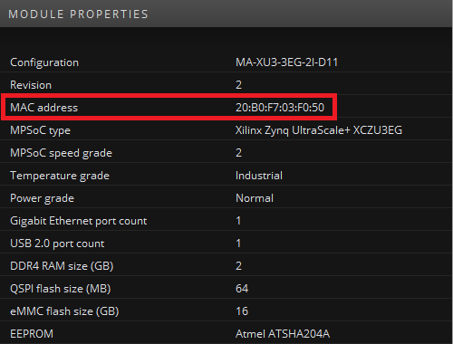
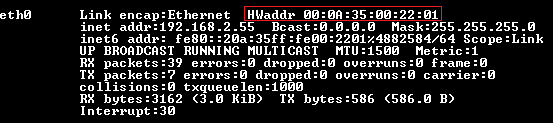

# 1 - MAC address
The MAC address is a unique identifier assigned by Enclustra to its network capable hardware. In this way,
several hardware devices in a network can be identified individually. By default, Enclustra assigns two unique
MAC addresses (Modules with three PHYs such as the [Mercury+ SA2](https://www.enclustra.com/en/products/system-on-chip-modules/mercury-sa2/) still only get two MAC addresses). The second MAC address is the first one incremented by one (Only one MAC address is stored in the EEPROM). In that way, devices with two Gigabit Ethernet ports can be used with unique identifiers. The MAC address is stored in the Secure EEPROM at a specific address. Please refer to the respective user manual to obtain the specific register address where the MAC address is stored and what format (big-endian or little-endian byte order). There are several ways of obtaining the MAC address described in the following sections.

## 1.1 - Module Configuration Tool (MCT)
The [Enclustra MCT](https://www.enclustra.com/en/products/tools/module-configuration-tool/) offers a quick and easy way to obtain the MAC address of the module in use. Only a USB connection is required to access and configure various base board and module properties. Please refer to the respective user manual for the correct board setup. The MAC address is highlighted by a red rectangle in the screenshot below.

## 1.2 - Bare metal
As the information is stored on the Secure EEPROM one possibility to obtain the MAC address is to read the specific registers via I2C. Please refer to the Enclustra I2C Application Note for more details ([Enclustra I2C Application Note](https://github.com/enclustra/I2CApplicationNote)). The MAC address can also be set in a bare metal application. Xilinx provides a helper function `xemac_add` as part of the [LWIP library](https://xilinx-wiki.atlassian.net/wiki/spaces/A/pages/18842366/Standalone+LWIP+library) in the Xilinx Software Development Kit (XSDK) as well as Vitis. This function takes the IP address and the Ethernet MAC address for the interface and initializes it. For more details see the [Xilinx App Note XAPP1026](https://www.xilinx.com/support/documentation/application_notes/xapp1026.pdf).

## 1.3 - U-boot
In U-boot the MAC address can be accessed and modified using environmental variables. The variable `ethaddr` contains the assigned MAC address. If several Ethernet ports are present, there are several variables for each individual MAC address (`ethaddr`, `ethaddr1`, etc.). U-boot reads the device specific MAC address from the Secure EEPROM. The value can be accessed using the command `printenv` (to list all environmental variables) or, more specifically, `printenv ethaddr` to print only the value for the MAC address. The `setenv` command also allows setting the MAC address manually in U-boot (e.g `setenv ethaddr 20:B0:F7:03:F0:30`).

## 1.4 - Linux
In Linux the MAC address can be accessed with the command `ifconfig -a`. A serial console output example for the previously described command is shown below.

The MAC address is available under HWaddr and highlighted by a red rectangle in the figure. The device tree entry to enable Ethernet usually contains a line specifying a local MAC address. This entry is typically overwritten by the value set in U-Boot when using Enclustra Build Environment (EBE). As U-Boot reads the MAC address directly from the Secure EEPROM it gets the modules unique MAC address assigned by Enclustra during production.

**Please continue reading chapter 2 [RGMII timing constraints](./Chapter-2-RGMII_timing_constraints.md)**
