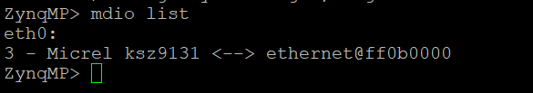

# 2 PHY Configuration

In this chapter, the timing constraints of Ethernet PHY integrated circuits used on Enclustra modules are explained. Our modules utilize two types of Microchip PHYs, each with distinct characteristics. These PHYs are responsible for handling the physical layer of Ethernet communication, ensuring proper signal integrity, link negotiation, and data transmission. 

* [Microchip KSZ9031RNX](https://www.microchip.com/en-us/product/KSZ9031)
* [Microchip KSZ9131RNX](https://www.microchip.com/en-us/product/KSZ9131)

## 2.1 KSZ9031RNX
MII is a standard interface to connect an Ethernet MAC to a PHY chip. There are different versions of this interface. Enclustra uses RGMII to make the connection between Gigabit Ethernet and the PHY chip in use, which is the [Microchip KSZ9031RNX](https://www.microchip.com/wwwproducts/en/KSZ9031). The RGMII standard specifies that data and clock be output simultaneously. In order to sample the data signals properly at the receiver side, a skew has to be added to the clock signal according to the RGMII standard. This can be done either by PCB traces or directly by the receiver itself. The second method is used by Enclustra by setting the correct values in the pad skew registers of the Ethernet PHY. The skew values are specified in the respective user manual of the hardware in use.

### 2.1.1 PHY register configuration via MDIO
The configuration of the PHY is done by setting the correct register values via MDIO. The figure below shows the
register values for the Mercury XU1 module as an example. There are several ways of writing the values to the PHY registers discussed in the following sections.


### 2.1.2 Bare metal

#### 2.1.2.1 LWIP Echo Example

The [Xilinx LWIP library](https://xilinx-wiki.atlassian.net/wiki/spaces/A/pages/18842366/Standalone+LWIP+library) offers a function which initializes the network interface and thus configures the PHY during the initialization. During initialization a function to setup the PHY delays is called. This function writes the necessary registers with the values specified in the user manual or device tree. 

The **KSZ9031RNX** is not natively supported by the Xilinx LWIP and therefore handling this device needs to be added manually. A custom function is responsible for setting the RGMII delays of the PHY. The write procedure is described in detail in the [data sheet of the KSZ9031RNX](http://ww1.microchip.com/downloads/en/DeviceDoc/00002117F.pdf). 

A modified version of the standard LWIP files is included in the material accompanying this Application Note where the necessary changes are included already for **Zynq SoC**, **Zynq MPSoC** ([xemacpsif_physpeed.c](./code/RGMII/LWIPModifications/xemacpsif_physpeed.c)) and **Microblaze** ([xaxiemacif_physpeed.c](./code/RGMII/LWIPModifications/xaxiemacif_physpeed.c)) designs.

The skew values should be obtained from the device tree of the relevant reference design. However, note that the device tree entries represent **delay times**, not direct register values. The actual register values and their mapping can be found in the [Micrel KSZ90x1 device tree binding documentation](https://github.com/Xilinx/linux-xlnx/blob/master/Documentation/devicetree/bindings/net/micrel-ksz90x1.txt) or datasheet. If your reference design uses different delay settings, you should update the corresponding code section to match the required mapped register values. The code section to modify is shown below and should be updated if the skew values are not set to the defaults.

This example is tested on Mercury+ XU8 module and ST1 baseboard combination.

```c
if (phy_model == PHY_MICREL_KSZ9031_MODEL)
{
	xil_printf("Detected Micrel KSZ9031 PHY at address %d\r\n", phy_addr);
	RxCtrlSkew = 7; // 0..15
	TxCtrlSkew = 7; // 0..15

	RxDataSkew = 7; // 0..15
	TxDataSkew = 7; // 0..15

	RxClockSkew = 15; // 0..31
	TxClockSkew = 30; // 0..31
}
```


The output of [LWIP Echo server application](https://github.com/Xilinx/embeddedsw/tree/master/lib/sw_apps/lwip_echo_server/src) is shown below.


**Important Note**: If you encounter issues with the KSZ9031RNX PHY, please consult the official errata document from Microchip:[KSZ9031RNX Silicon Errata and Data Sheet Clarification](https://ww1.microchip.com/downloads/aemDocuments/documents/OTH/ProductDocuments/Errata/80000692D.pdf).

#### 2.1.2.2 FSBL Hook Example

For **Zynq SoC** and **Zynq MPSoC** another possible way to setup the RGMII delays is in the First Stage Boot Loader (FSBL). The following code excerpt from the [fsbl_hooks.c](./code/RGMII/FSBLModifications/fsbl_hooks.c) file shows how this can be done:

```c
// detect PHY
PhyAddr = 3;
XEmacPs_PhyRead(EmacPsInstancePtr, PhyAddr, 0x3, (u16*)&PhyData);  // read value
PhyType = (PhyData >> 4);

// enabling RGMII delays
if (PhyType == 0x162){ // KSZ9031
    XFsbl_Printf(DEBUG_GENERAL,"Detected KSZ9031 Ethernet PHY\n\r");
    //Ctrl Delay
    u16 RxCtrlDelay=7; // 0..15, default 7
    u16 TxCtrlDelay=7; // 0..15, default 7
    XEmacPs_PhyWrite(EmacPsInstancePtr, PhyAddr, 0xD, 0x0002);
    XEmacPs_PhyWrite(EmacPsInstancePtr, PhyAddr, 0xE, 0x0004); // Reg 0x4
    XEmacPs_PhyWrite(EmacPsInstancePtr, PhyAddr, 0xD, 0x4002);
    XEmacPs_PhyWrite(EmacPsInstancePtr, PhyAddr, 0xE, (TxCtrlDelay+(RxCtrlDelay<<4)));
    //Data Delay
    u16 RxDataDelay=7; // 0..15, default 7
    u16 TxDataDelay=7; // 0..15, default 7
    XEmacPs_PhyWrite(EmacPsInstancePtr, PhyAddr, 0xD, 0x0002);
    XEmacPs_PhyWrite(EmacPsInstancePtr, PhyAddr, 0xE, 0x0005); // Reg 0x5
    XEmacPs_PhyWrite(EmacPsInstancePtr, PhyAddr, 0xD, 0x4002);
    XEmacPs_PhyWrite(EmacPsInstancePtr, PhyAddr, 0xE, (RxDataDelay+(RxDataDelay << 4)+(RxDataDelay << 8)+(RxDataDelay << 12)));
    XEmacPs_PhyWrite(EmacPsInstancePtr, PhyAddr, 0xD, 0x0002);
    XEmacPs_PhyWrite(EmacPsInstancePtr, PhyAddr, 0xE, 0x0006); // Reg 0x6
    XEmacPs_PhyWrite(EmacPsInstancePtr, PhyAddr, 0xD, 0x4002);
    XEmacPs_PhyWrite(EmacPsInstancePtr, PhyAddr, 0xE, (TxDataDelay+(TxDataDelay << 4)+(TxDataDelay << 8)+(TxDataDelay << 12)));
    //Clock Delay
    u16 RxClockDelay=31; // 0..31, default 15
    u16 TxClockDelay=31; // 0..31, default 15
    XEmacPs_PhyWrite(EmacPsInstancePtr, PhyAddr, 0xD, 0x0002);
    XEmacPs_PhyWrite(EmacPsInstancePtr, PhyAddr, 0xE, 0x0008); // Reg 0x8 RGMII Clock Pad Skew
    XEmacPs_PhyWrite(EmacPsInstancePtr, PhyAddr, 0xD, 0x4002);
    XEmacPs_PhyWrite(EmacPsInstancePtr, PhyAddr, 0xE, (RxClockDelay+(TxClockDelay<<5)));
} else if (PhyType == 0x161){ // KSZ9021
    XFsbl_Printf(DEBUG_GENERAL,"Detected KSZ9021 Ethernet PHY\n\r");
    XEmacPs_PhyWrite(EmacPsInstancePtr, PhyAddr, 0xB, 0x8104); // write Reg 0x104
    XEmacPs_PhyWrite(EmacPsInstancePtr, PhyAddr, 0xC, 0xF0F0); // set write data
    XEmacPs_PhyWrite(EmacPsInstancePtr, PhyAddr, 0xB, 0x8105); // write Reg 0x105
    XEmacPs_PhyWrite(EmacPsInstancePtr, PhyAddr, 0xC, 0x0000); // set write data
}

// Issue a reset to phy
Status  = XEmacPs_PhyRead(EmacPsInstancePtr, PhyAddr, 0x0, &PhyData);
PhyData |= 0x8000;
Status = XEmacPs_PhyWrite(EmacPsInstancePtr, PhyAddr, 0x0, PhyData);
for (i=0; i<100000; i++);
Status |= XEmacPs_PhyRead(EmacPsInstancePtr, PhyAddr, 0x0, &PhyData);
if (Status != XST_SUCCESS)
{
    XFsbl_Printf(DEBUG_GENERAL,"Error reset phy \n\r");
    return -1;
} else {
    return 0;
}
```

**WARNING: The code provided may not be compatible with every tool version as the libraries can be different from version to version. Therefore, changes to the code might be necessary depending on the software and library version in use.**

### 2.1.3 U-boot
In U-boot the necessary driver needs to be selected which automatically configures the PHY delay registers with the default value stated in the [data sheet of the KSZ9031RNX](http://ww1.microchip.com/downloads/en/DeviceDoc/00002117F.pdf). The driver for the **KSZ9031** PHY chip is located in `Device Drivers -> Ethernet PHY (physical media interface) support -> Micrel Ethernet PHYs support -> Micrel KSZ90x1` family support. 

The MDIO registers can also be accessed and written to in U-boot. The commands `mdio` and `mii` provide read and write as well as other utility functions to configure the PHY chip. Please refer to the [data sheet of the KSZ9031RNX](http://ww1.microchip.com/downloads/en/DeviceDoc/00002117F.pdf) for detailed instructions regarding writing and reading registers. 

An example output for the command listing the present Ethernet PHY devices is shown below.


The command `mii info` gives further information as shown below. 


With `mii dump` the PHY control registers can be accessed as well.


### 2.1.4 Linux
The PHY register configuration can also be done in the Linux device tree. The [Github repository of Enclustra](https://github.com/enclustra) provides device tree files for Enclustra modules in which the configuration of the PHY registers is already done. As an example an excerpt from the device tree file for the Enclustra Mercury XU1 is shown.

```
/ {
	aliases {
		ethernet0 = &gem0;
		ethernet1 = &gem3;
		i2c0 = &i2c0;
		serial0 = &uart0;
		spi0 = &qspi;
	};
};

&gem0 {
	status = "okay";
	local-mac-address = [00 0a 35 00 02 90];
	phy-mode = "rgmii-id";
	phy-handle = <&phy0>;
	phy0: phy@3 {
		reg = <3>;

		txc-skew-ps = <1800>;
		txen-skew-ps = <420>;

		txd0-skew-ps = <420>;
		txd1-skew-ps = <420>;
		txd2-skew-ps = <420>;
		txd3-skew-ps = <420>;

		rxc-skew-ps = <900>;
		rxdv-skew-ps = <420>;

		rxd0-skew-ps = <420>;
		rxd1-skew-ps = <420>;
		rxd2-skew-ps = <420>;
		rxd3-skew-ps = <420>;
	};
	phy1: phy@7 {
		reg = <7>;

		txc-skew-ps = <1800>;
		txen-skew-ps = <420>;

		txd0-skew-ps = <420>;
		txd1-skew-ps = <420>;
		txd2-skew-ps = <420>;
		txd3-skew-ps = <420>;

		rxc-skew-ps = <900>;
		rxdv-skew-ps = <420>;

		rxd0-skew-ps = <420>;
		rxd1-skew-ps = <420>;
		rxd2-skew-ps = <420>;
		rxd3-skew-ps = <420>;
	};
};

&gem3 {
	status = "okay";
	local-mac-address = [00 0a 35 00 02 91];
	phy-handle = <&phy1>;
	phy-mode = "rgmii-id";
};
```

The values for the registers are obtained from the XU1 user manual. The `ps` values are calculated by referring to the [data sheet of the KSZ9031RNX](http://ww1.microchip.com/downloads/en/DeviceDoc/00002117F.pdf). For example, the register value for `TXD0` is given as `0111` in case of the XU1 user manual. For this register, the step size according to the PHY data sheet is `60 ps`. Therefore, the value that is set for `TXD0` in the device tree is `420 ps`. 

## 2.2 KSZ9131RNX
Some Enclustra modules, such as Mercury+ XU6, Mercury+ XU61, and Andromeda XZU65, incorporate the [Microchip KSZ9131RNX](https://www.microchip.com/en-us/product/KSZ9131) Ethernet PHY to establish an RGMII interface between Gigabit Ethernet MAC and PHY. This chapter explains the configuration of pad skew registers at different software levels, including Baremetal, U-Boot, and Linux. The optimal skew values for each module are provided in the respective user manual, ensuring proper signal timing.

### 2.2.1 PHY register configuration via MDIO
The configuration of the PHY is achieved by setting the appropriate register values via MDIO interface. The figure below presents the register values of PHY for the Mercury+ XU6 module as an example. There are multiple methods for writing these values to the PHY registers, which are discussed in the following sections. These register values define the internal delay on chip between the clock and data lines, ensuring proper signal alignment and reliable Ethernet communication.

The skew values are iteratively tested by Enclustra to identify the most optimized configuration for stable and high-performance Ethernet communication. Based on these tests, the best-performing skew values were determined.


### 2.2.2 Bare metal

#### 2.2.2.1 LWIP Echo Example

[Xilinx LWIP library](https://xilinx-wiki.atlassian.net/wiki/spaces/A/pages/18842366/Standalone+LWIP+library) offers a function which initializes the network interface and thus configures the PHY during the initialization. During initialization a function to setup the PHY delays is called. This function writes the necessary registers with the values specified in the user manual. 

**KSZ9131RNX** is not natively supported by the Xilinx LWIP and therefore handling this device needs to be added manually. A custom function is responsible for setting the RGMII delays of the PHY. 

A modified version of the standard LWIP files is included in the material accompanying this Application Note where the necessary changes are included already for **Zynq SoC**, **Zynq MPSoC** ([xemacpsif_physpeed.c](./code/RGMII/LWIPModifications/xemacpsif_physpeed.c)) and **Microblaze** ([xaxiemacif_physpeed.c](./code/RGMII/LWIPModifications/xaxiemacif_physpeed.c)) designs.

The same steps described in the KSZ9030RNX section can be used to set the skew values for KSZ9131RNX. However, note that some Enclustra modules, such as the **Andromeda XZU65**, use a **KSZ9131RNX PHY** connected via PL pins. In these designs, **GMII-to-RGMII conversion** is handled on the PL side [see Section 5 for details](Chapter-5-GMII_to_RGMII.md). When the KSZ9131RNX PHY is connected through PL pins, it is recommended to check phy-mode in the device-tree. As shown in the [Linux driver source code of PHY](https://github.com/Xilinx/linux-xlnx/blob/d4812993d4bdbacde2879124371eb2273529e87b/drivers/net/phy/micrel.c#L1229), the TXC/RXC DLL bit is disabled when PHY is configured in RGMII mode.

```dts
phy-mode = "rgmii";
```
Defining `ANDROMEDA_XZU65_ST1` enables TXC/RXC DLL bypass bit in the register in the following part of the code.


```c
#ifdef ANDROMEDA_XZU65_ST1
	// Read RXD DLL Control Register
	XEmacPs_PhyWrite(xemacpsp, phy_addr, IEEE_MMD_ACCESS_CONTROL_REG, 0x0002);
	XEmacPs_PhyWrite(xemacpsp, phy_addr, IEEE_MMD_ACCESS_ADDRESS_DATA_REG, 0x004C); // Reg 0x76
	XEmacPs_PhyWrite(xemacpsp, phy_addr, IEEE_MMD_ACCESS_CONTROL_REG, 0x4002);
	XEmacPs_PhyRead(xemacpsp, phy_addr, IEEE_MMD_ACCESS_ADDRESS_DATA_REG, &RxDll);

	// Read TXD DLL Control Register
	XEmacPs_PhyWrite(xemacpsp, phy_addr, IEEE_MMD_ACCESS_CONTROL_REG, 0x0002);
	XEmacPs_PhyWrite(xemacpsp, phy_addr, IEEE_MMD_ACCESS_ADDRESS_DATA_REG, 0x004D); // Reg 0x77
	XEmacPs_PhyWrite(xemacpsp, phy_addr, IEEE_MMD_ACCESS_CONTROL_REG, 0x4002);
	XEmacPs_PhyRead(xemacpsp, phy_addr, IEEE_MMD_ACCESS_ADDRESS_DATA_REG, &TxDll);

	// GMII-to-RGMII Converter
	if (phy_addr == 0x7)
	{
		xil_printf("Setting delays for operation with PL GMII-to-RGMII converter");
		RxCtrlSkew = 7;  // 0..15
		TxCtrlSkew = 7;  // 0..15
		RxDataSkew = 7;  // 0..15
		TxDataSkew = 7;  // 0..15
		RxClockSkew = 0; // 0..31
		TxClockSkew = 7; // 0..31

		RxDll |= (1 << 12); //  RXC DLL delay is not used
		TxDll |= (1 << 12); //  TXC DLL delay is not used
	}
	else 
	{
		RxCtrlSkew = 7;   // 0..15
		TxCtrlSkew = 7;   // 0..15
		RxDataSkew = 7;   // 0..15
		TxDataSkew = 7;   // 0..15
		RxClockSkew = 7;  // 0..31
		TxClockSkew = 7; // 0..31
	}
#else
	RxCtrlSkew = 7;   // 0..15
	TxCtrlSkew = 7;   // 0..15
	RxDataSkew = 7;   // 0..15
	TxDataSkew = 7;   // 0..15
	RxClockSkew = 7;  // 0..31
	TxClockSkew = 30; // 0..31
#endif
```
```c
#ifdef ANDROMEDA_XZU65_ST1
    if ((phy_model == PHY_MICREL_KSZ9131_MODEL) && (phy_addr == 0x7))
    {
        // Write RXD DLL Control Register
        XEmacPs_PhyWrite(xemacpsp, phy_addr, IEEE_MMD_ACCESS_CONTROL_REG, 0x0002);
        XEmacPs_PhyWrite(xemacpsp, phy_addr, IEEE_MMD_ACCESS_ADDRESS_DATA_REG, 0x004C); // Reg 0x76
        XEmacPs_PhyWrite(xemacpsp, phy_addr, IEEE_MMD_ACCESS_CONTROL_REG, 0x4002);
        XEmacPs_PhyWrite(xemacpsp, phy_addr, IEEE_MMD_ACCESS_ADDRESS_DATA_REG, RxDll);

        // Write TXD DLL Control Register
        XEmacPs_PhyWrite(xemacpsp, phy_addr, IEEE_MMD_ACCESS_CONTROL_REG, 0x0002);
        XEmacPs_PhyWrite(xemacpsp, phy_addr, IEEE_MMD_ACCESS_ADDRESS_DATA_REG, 0x004D); // Reg 0x77
        XEmacPs_PhyWrite(xemacpsp, phy_addr, IEEE_MMD_ACCESS_CONTROL_REG, 0x4002);
        XEmacPs_PhyWrite(xemacpsp, phy_addr, IEEE_MMD_ACCESS_ADDRESS_DATA_REG, TxDll);
    }
#endif
```
**Important Note**: If you encounter issues with the KSZ9131RNX PHY, please consult the official errata document from Microchip:[KSZ9131RNX Silicon Errata and Data Sheet Clarification](https://ww1.microchip.com/downloads/aemDocuments/documents/UNG/ProductDocuments/Errata/KSZ9131RNX-Silicon-Errata-and-Data-Sheet-Clarification-80000863B.pdf).

#### 2.2.2.2 FSBL Hook Example
The PHY can be programmed at the FSBL level for Zynq SoC and Zynq MPSoC by modifying [fsbl_hooks.c](./code/RGMII/FSBLModifications/fsbl_hooks.c) file. The following code is integrated into this file to configure the skew values for the clock and data lines. The skew values are directly written to the PHY registers via MDIO during the FSBL hook process. This allows early initialization of the PHY timing parameters, ensuring that the correct delay settings are applied before the system fully boots.

For more details on reading and writing PHY registers, refer to the KSZ9131RNX datasheet, which provides a complete register map and configuration options.
```c
	// detect PHY
	PhyAddr = 3;
	XEmacPs_PhyRead(EmacPsInstancePtr, PhyAddr, 0x3, (u16 *)&PhyData); // read value
	PhyType = (PhyData >> 4);

	// enabling RGMII delays
	if (PhyType == 0x162)
	{ // KSZ9031
		XFsbl_Printf(DEBUG_GENERAL, "Detected KSZ9031 Ethernet PHY\n\r");
		// Ctrl Delay
		u16 RxCtrlDelay = 7; // 0..15, default 7
		u16 TxCtrlDelay = 7; // 0..15, default 7
		XEmacPs_PhyWrite(EmacPsInstancePtr, PhyAddr, 0xD, 0x0002);
		XEmacPs_PhyWrite(EmacPsInstancePtr, PhyAddr, 0xE, 0x0004); // Reg 0x4
		XEmacPs_PhyWrite(EmacPsInstancePtr, PhyAddr, 0xD, 0x4002);
		XEmacPs_PhyWrite(EmacPsInstancePtr, PhyAddr, 0xE, (TxCtrlDelay + (RxCtrlDelay << 4)));
		// Data Delay
		u16 RxDataDelay = 7; // 0..15, default 7
		u16 TxDataDelay = 7; // 0..15, default 7
		XEmacPs_PhyWrite(EmacPsInstancePtr, PhyAddr, 0xD, 0x0002);
		XEmacPs_PhyWrite(EmacPsInstancePtr, PhyAddr, 0xE, 0x0005); // Reg 0x5
		XEmacPs_PhyWrite(EmacPsInstancePtr, PhyAddr, 0xD, 0x4002);
		XEmacPs_PhyWrite(EmacPsInstancePtr, PhyAddr, 0xE, (RxDataDelay + (RxDataDelay << 4) + (RxDataDelay << 8) + (RxDataDelay << 12)));
		XEmacPs_PhyWrite(EmacPsInstancePtr, PhyAddr, 0xD, 0x0002);
		XEmacPs_PhyWrite(EmacPsInstancePtr, PhyAddr, 0xE, 0x0006); // Reg 0x6
		XEmacPs_PhyWrite(EmacPsInstancePtr, PhyAddr, 0xD, 0x4002);
		XEmacPs_PhyWrite(EmacPsInstancePtr, PhyAddr, 0xE, (TxDataDelay + (TxDataDelay << 4) + (TxDataDelay << 8) + (TxDataDelay << 12)));
		// Clock Delay
		u16 RxClockDelay = 31; // 0..31, default 15
		u16 TxClockDelay = 31; // 0..31, default 15
		XEmacPs_PhyWrite(EmacPsInstancePtr, PhyAddr, 0xD, 0x0002);
		XEmacPs_PhyWrite(EmacPsInstancePtr, PhyAddr, 0xE, 0x0008); // Reg 0x8 RGMII Clock Pad Skew
		XEmacPs_PhyWrite(EmacPsInstancePtr, PhyAddr, 0xD, 0x4002);
		XEmacPs_PhyWrite(EmacPsInstancePtr, PhyAddr, 0xE, (RxClockDelay + (TxClockDelay << 5)));
	}
	else if (PhyType == 0x161)
	{ // KSZ9021
		XFsbl_Printf(DEBUG_GENERAL, "Detected KSZ9021 Ethernet PHY\n\r");
		XEmacPs_PhyWrite(EmacPsInstancePtr, PhyAddr, 0xB, 0x8104); // write Reg 0x104
		XEmacPs_PhyWrite(EmacPsInstancePtr, PhyAddr, 0xC, 0xF0F0); // set write data
		XEmacPs_PhyWrite(EmacPsInstancePtr, PhyAddr, 0xB, 0x8105); // write Reg 0x105
		XEmacPs_PhyWrite(EmacPsInstancePtr, PhyAddr, 0xC, 0x0000); // set write data
	}
	else if (PhyType == 0x164)
	{ // KSZ9131
		XFsbl_Printf(DEBUG_GENERAL, "Detected KSZ9131 Ethernet PHY\n\r");
		// Ctrl Delay
		u16 RxCtrlDelay = 7; // 0..15, default 7
		u16 TxCtrlDelay = 7; // 0..15, default 7
		XEmacPs_PhyWrite(EmacPsInstancePtr, PhyAddr, 0xD, 0x0002);
		XEmacPs_PhyWrite(EmacPsInstancePtr, PhyAddr, 0xE, 0x0004); // Device Address 0x2 - Reg 0x4
		XEmacPs_PhyWrite(EmacPsInstancePtr, PhyAddr, 0xD, 0x4002);
		XEmacPs_PhyWrite(EmacPsInstancePtr, PhyAddr, 0xE, (TxCtrlDelay + (RxCtrlDelay << 4)));

		// Data Delay
		u16 RxDataDelay = 7; // 0..15, default 7
		XEmacPs_PhyWrite(EmacPsInstancePtr, PhyAddr, 0xD, 0x0002);
		XEmacPs_PhyWrite(EmacPsInstancePtr, PhyAddr, 0xE, 0x0005); // Device Address 0x2 - Reg 0x5
		XEmacPs_PhyWrite(EmacPsInstancePtr, PhyAddr, 0xD, 0x4002);
		XEmacPs_PhyWrite(EmacPsInstancePtr, PhyAddr, 0xE, (RxDataDelay + (RxDataDelay << 4) + (RxDataDelay << 8) + (RxDataDelay << 12)));
		u16 TxDataDelay = 7; // 0..15, default 7
		XEmacPs_PhyWrite(EmacPsInstancePtr, PhyAddr, 0xD, 0x0002);
		XEmacPs_PhyWrite(EmacPsInstancePtr, PhyAddr, 0xE, 0x0006); // Device Address 0x2 - Reg 0x6
		XEmacPs_PhyWrite(EmacPsInstancePtr, PhyAddr, 0xD, 0x4002);
		XEmacPs_PhyWrite(EmacPsInstancePtr, PhyAddr, 0xE, (TxDataDelay + (TxDataDelay << 4) + (TxDataDelay << 8) + (TxDataDelay << 12)));

		// Clock Delay
		u16 RxClockDelay = 7; // 0..31, default 7
		u16 TxClockDelay = 30; // 0..31, default 7
		XEmacPs_PhyWrite(EmacPsInstancePtr, PhyAddr, 0xD, 0x0002);
		XEmacPs_PhyWrite(EmacPsInstancePtr, PhyAddr, 0xE, 0x0008); // Device Address 0x2 - Reg 0x8 RGMII Clock Pad Skew
		XEmacPs_PhyWrite(EmacPsInstancePtr, PhyAddr, 0xD, 0x4002);
		XEmacPs_PhyWrite(EmacPsInstancePtr, PhyAddr, 0xE, (RxClockDelay + (TxClockDelay << 5)));
	}
	else
	{
		XFsbl_Printf(DEBUG_GENERAL, "Unknown PHY type: 0x%x\n\r", PhyType);
	}

	// Issue a reset to phy
	Status = XEmacPs_PhyRead(EmacPsInstancePtr, PhyAddr, 0x0, &PhyData);
	PhyData |= 0x8000;
	Status = XEmacPs_PhyWrite(EmacPsInstancePtr, PhyAddr, 0x0, PhyData);
	for (i = 0; i < 100000; i++)
		;
	Status |= XEmacPs_PhyRead(EmacPsInstancePtr, PhyAddr, 0x0, &PhyData);
	if (Status != XST_SUCCESS)
	{
		XFsbl_Printf(DEBUG_GENERAL, "Error reset phy \n\r");
		return -1;
	}
	else
	{
		return 0;
	}
```


### 2.2.3 U-Boot

In U-boot the necessary driver needs to be selected which automatically configures the PHY delay registers with the default value stated in the [data sheet of the KSZ9131RNX](https://ww1.microchip.com/downloads/aemDocuments/documents/UNG/ProductDocuments/DataSheets/00002841D.pdf). The driver for the **KSZ9131** PHY chip is located in U-Boot config menu `Device Drivers -> Ethernet PHY (physical media interface) support -> Micrel Ethernet PHYs support -> Micrel KSZ90x1 family support`. 

The MDIO registers can also be accessed and written to in U-boot. The commands `mdio` and `mii` provide read and write as well as other utility functions to configure the PHY chip. Please refer to the [data sheet of the KSZ9131RNX](https://ww1.microchip.com/downloads/aemDocuments/documents/UNG/ProductDocuments/DataSheets/00002841D.pdf) for detailed instructions regarding writing and reading registers. The source code of U-Boot driver for KSZ9131 is available at [Xilinx U-Boot repository](https://github.com/Xilinx/u-boot-xlnx/blob/38eb17fa2bd1db2f2abc6ea1132a61962011d9cf/drivers/net/phy/micrel_ksz90x1.c). 

An example output for the command listing the present Ethernet PHY devices is shown below.



The command `mii info` gives further information as shown below. 


With `mii dump` the PHY control registers can be accessed as well.


### 2.2.4 Linux

Linux driver for the KSZ9131 PHY is provided by AMD and is available in the [Xilinx GitHub repository](https://github.com/Xilinx/linux-xlnx/blob/d8528968a1b313254305cfdc224c39db2d7bf562/drivers/net/phy/micrel.c) . This driver ensures proper initialization, configuration, and management of the PHY within the Linux environment. It includes support for MDIO-based register access, enabling dynamic control of skew settings, link negotiation etc.

The documentation of device tree binding for Microchip's PHY is available at [Xilinx Linux repository](https://github.com/Xilinx/linux-xlnx/blob/master/Documentation/devicetree/bindings/net/micrel-ksz90x1.txt). To ensure proper operation, the skew value entries must be configured according to the requirements specified in the driver. These values adjust the timing parameters of the PHY, optimizing signal integrity and link stability.


```
&gem0 {
	status = "okay";
	/delete-property/ local-mac-address;
	phy-mode = "rgmii-id";
	phy-handle = <&phy0>;
	phy0: phy@3 {
		reg = <3>;
		/* Delays for KSZ9131 PHY */
		txc-skew-psec = <900>;
		txen-skew-psec = <0>;
		txd0-skew-psec = <0>;
		txd1-skew-psec = <0>;
		txd2-skew-psec = <0>;
		txd3-skew-psec = <0>;

		rxc-skew-psec = <0>;
		rxdv-skew-psec = <0>;
		rxd0-skew-psec = <0>;
		rxd1-skew-psec = <0>;
		rxd2-skew-psec = <0>;
		rxd3-skew-psec = <0>;
	};
};
```

The driver output for the KSZ9131 PHY can be checked in the kernel message log using `dmesg | grep "KSZ"`


The registers of the PHY can be accessed using `phytool`


The values for the registers are obtained from the Mercury+ XU6 user manual. The `ps` values are calculated by referring to the [data sheet of the KSZ9131RNX](https://ww1.microchip.com/downloads/aemDocuments/documents/UNG/ProductDocuments/DataSheets/00002841D.pdf). For example, the register value for `TXD0` is given as `0111` in case of the Mercury+ XU6 user manual. For this register, the step size according to the PHY data sheet is `100 ps`. Also, [ Xilinx Linux driver](https://github.com/Xilinx/linux-xlnx/blob/master/Documentation/devicetree/bindings/net/micrel-ksz90x1.txt) specifies the valid device tree skew value range for the KSZ9131 PHY from `-700` ps to `800` ps. Within this range, the mapped value for `0111` corresponds to `0`, meaning no additional delay is applied. This mapped value serves as the device tree entry to configure the RGMII delay.

**Please continue reading chapter 3 [1G PL SFP](./Chapter-3-1G_PL_SFP.md)**
