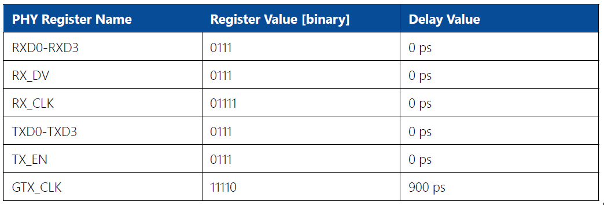
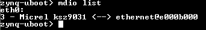
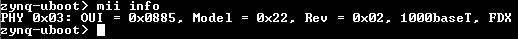
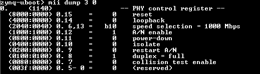

# 2 - RGMII timing contraints
MII is a standard interface to connect an Ethernet MAC to a PHY chip. There are different versions of this interface. Enclustra uses RGMII to make the connection between Gigabit Ethernet and the PHY chip in use, which is the [Microchip KSZ9031RNX](https://www.microchip.com/wwwproducts/en/KSZ9031). The RGMII standard specifies that data and clock be output simultaneously. In order to sample the data signals properly at the receiver side, a skew has to be added to the clock signal according to the RGMII standard. This can be done either by PCB traces or directly by the receiver itself. The second method is used by Enclustra by setting the correct values in the pad skew registers of the Ethernet PHY. The skew values are specified in the respective user manual of the hardware in use.

## 2.1 - PHY register configuration via MDIO
The configuration of the PHY is done by setting the correct register values via MDIO. The figure below shows the
register values for the Mercury XU1 module as an example. There are several ways of writing the values to the PHY registers discussed in the following sections.



## 2.2 - Bare metal
The [Xilinx LWIP library](https://xilinx-wiki.atlassian.net/wiki/spaces/A/pages/18842366/Standalone+LWIP+library) offers a function which initializes the network interface and thus configures the PHY during the initialization. During initialization a function to setup the PHY delays is called. This function writes the necessary registers with the values specified in the user manual. 

The **KSZ9031RNX** is not natively supported by the Xilinx LWIP and therefore handling this device needs to be added manually. A custom function is responsible for setting the RGMII delays of the PHY. The write procedure is described in detail in the [data sheet of the KSZ9031RNX](http://ww1.microchip.com/downloads/en/DeviceDoc/00002117F.pdf). 

A modified version of the standard LWIP files is included in the material accompanying this Application Note where the necessary changes are included already for **Zynq SoC**, **Zynq MPSoC** ([xaxiemacif_physpeed.c](./code/RGMII/LWIPModifications/xaxiemacif_physpeed.c)) and **Microblaze** ([xemacpsif_physpeed.c](./code/RGMII/LWIPModifications/xemacpsif_physpeed.c)) designs.

For **Zynq SoC** and **Zynq MPSoC** another possible way to setup the RGMII delays is in the First Stage Boot Loader (FSBL). The following code excerpt from the [fsbl_hooks.c](./code/RGMII/FSBLModifications/fsbl_hooks.c) file shows how this can be done:

```c
// detect PHY
PhyAddr = 3;
XEmacPs_PhyRead(EmacPsInstancePtr, PhyAddr, 0x3, (u16*)&PhyData);  // read value
PhyType = (PhyData >> 4);

// enabling RGMII delays
if (PhyType == 0x162){ // KSZ9031
    XFsbl_Printf(DEBUG_GENERAL,"Detected KSZ9031 Ethernet PHY\n\r");
    //Ctrl Delay
    u16 RxCtrlDelay=7; // 0..15, default 7
    u16 TxCtrlDelay=7; // 0..15, default 7
    XEmacPs_PhyWrite(EmacPsInstancePtr, PhyAddr, 0xD, 0x0002);
    XEmacPs_PhyWrite(EmacPsInstancePtr, PhyAddr, 0xE, 0x0004); // Reg 0x4
    XEmacPs_PhyWrite(EmacPsInstancePtr, PhyAddr, 0xD, 0x4002);
    XEmacPs_PhyWrite(EmacPsInstancePtr, PhyAddr, 0xE, (TxCtrlDelay+(RxCtrlDelay<<4)));
    //Data Delay
    u16 RxDataDelay=7; // 0..15, default 7
    u16 TxDataDelay=7; // 0..15, default 7
    XEmacPs_PhyWrite(EmacPsInstancePtr, PhyAddr, 0xD, 0x0002);
    XEmacPs_PhyWrite(EmacPsInstancePtr, PhyAddr, 0xE, 0x0005); // Reg 0x5
    XEmacPs_PhyWrite(EmacPsInstancePtr, PhyAddr, 0xD, 0x4002);
    XEmacPs_PhyWrite(EmacPsInstancePtr, PhyAddr, 0xE, (RxDataDelay+(RxDataDelay << 4)+(RxDataDelay << 8)+(RxDataDelay << 12)));
    XEmacPs_PhyWrite(EmacPsInstancePtr, PhyAddr, 0xD, 0x0002);
    XEmacPs_PhyWrite(EmacPsInstancePtr, PhyAddr, 0xE, 0x0006); // Reg 0x6
    XEmacPs_PhyWrite(EmacPsInstancePtr, PhyAddr, 0xD, 0x4002);
    XEmacPs_PhyWrite(EmacPsInstancePtr, PhyAddr, 0xE, (TxDataDelay+(TxDataDelay << 4)+(TxDataDelay << 8)+(TxDataDelay << 12)));
    //Clock Delay
    u16 RxClockDelay=31; // 0..31, default 15
    u16 TxClockDelay=31; // 0..31, default 15
    XEmacPs_PhyWrite(EmacPsInstancePtr, PhyAddr, 0xD, 0x0002);
    XEmacPs_PhyWrite(EmacPsInstancePtr, PhyAddr, 0xE, 0x0008); // Reg 0x8 RGMII Clock Pad Skew
    XEmacPs_PhyWrite(EmacPsInstancePtr, PhyAddr, 0xD, 0x4002);
    XEmacPs_PhyWrite(EmacPsInstancePtr, PhyAddr, 0xE, (RxClockDelay+(TxClockDelay<<5)));
} else if (PhyType == 0x161){ // KSZ9021
    XFsbl_Printf(DEBUG_GENERAL,"Detected KSZ9021 Ethernet PHY\n\r");
    XEmacPs_PhyWrite(EmacPsInstancePtr, PhyAddr, 0xB, 0x8104); // write Reg 0x104
    XEmacPs_PhyWrite(EmacPsInstancePtr, PhyAddr, 0xC, 0xF0F0); // set write data
    XEmacPs_PhyWrite(EmacPsInstancePtr, PhyAddr, 0xB, 0x8105); // write Reg 0x105
    XEmacPs_PhyWrite(EmacPsInstancePtr, PhyAddr, 0xC, 0x0000); // set write data
}

// Issue a reset to phy
Status  = XEmacPs_PhyRead(EmacPsInstancePtr, PhyAddr, 0x0, &PhyData);
PhyData |= 0x8000;
Status = XEmacPs_PhyWrite(EmacPsInstancePtr, PhyAddr, 0x0, PhyData);
for (i=0; i<100000; i++);
Status |= XEmacPs_PhyRead(EmacPsInstancePtr, PhyAddr, 0x0, &PhyData);
if (Status != XST_SUCCESS)
{
    XFsbl_Printf(DEBUG_GENERAL,"Error reset phy \n\r");
    return -1;
} else {
    return 0;
}
```

**WARNING: The code provided may not be compatible with every tool version as the libraries can be different from version to version. Therefore, changes to the code might be necessary depending on the software and library version in use.**

## 2.3 - U-boot
In U-boot the necessary driver needs to be selected which automatically configures the PHY delay registers with the default value stated in the [data sheet of the KSZ9031RNX](http://ww1.microchip.com/downloads/en/DeviceDoc/00002117F.pdf). The driver for the **KSZ9031** PHY chip is located in `Device Drivers -> Ethernet PHY (physical media interface) support -> Micrel Ethernet PHYs support -> Micrel KSZ90x1` family support. 

The MDIO registers can also be accessed and written to in U-boot. The commands `mdio` and `mii` provide read and write as well as other utility functions to configure the PHY chip. Please refer to the [data sheet of the KSZ9031RNX](http://ww1.microchip.com/downloads/en/DeviceDoc/00002117F.pdf) for detailed instructions regarding writing and reading registers. 

An example output for the command listing the present Ethernet PHY devices is shown below.



The command `mii info` gives further information as shown below. 



With `mii dump` the PHY control registers can be accessed as well.



## 2.4 - Linux
The PHY register configuration can also be done in the Linux device tree. The [Enclustra EBE kernel](https://github.com/enclustra-bsp/xilinx-linux) provides device tree files for Enclustra modules in which the configuration of the PHY registers is already done. As an example an excerpt from the device tree file for the Enclustra Mercury XU1 is shown.

```
/ {
	aliases {
		ethernet0 = &gem0;
		ethernet1 = &gem3;
		i2c0 = &i2c0;
		serial0 = &uart0;
		spi0 = &qspi;
	};
};

&gem0 {
	status = "okay";
	local-mac-address = [00 0a 35 00 02 90];
	phy-mode = "rgmii-id";
	phy-handle = <&phy0>;
	phy0: phy@3 {
		reg = <3>;

		txc-skew-ps = <1800>;
		txen-skew-ps = <420>;

		txd0-skew-ps = <420>;
		txd1-skew-ps = <420>;
		txd2-skew-ps = <420>;
		txd3-skew-ps = <420>;

		rxc-skew-ps = <900>;
		rxdv-skew-ps = <420>;

		rxd0-skew-ps = <420>;
		rxd1-skew-ps = <420>;
		rxd2-skew-ps = <420>;
		rxd3-skew-ps = <420>;		
	};
	phy1: phy@7 {
		reg = <7>;

		txc-skew-ps = <1800>;
		txen-skew-ps = <420>;

		txd0-skew-ps = <420>;
		txd1-skew-ps = <420>;
		txd2-skew-ps = <420>;
		txd3-skew-ps = <420>;

		rxc-skew-ps = <900>;
		rxdv-skew-ps = <420>;

		rxd0-skew-ps = <420>;
		rxd1-skew-ps = <420>;
		rxd2-skew-ps = <420>;
		rxd3-skew-ps = <420>;		
	};
};

&gem3 {
	status = "okay";
	local-mac-address = [00 0a 35 00 02 91];
	phy-handle = <&phy1>;
	phy-mode = "rgmii-id";
};
```

The values for the registers are obtained from the XU1 user manual. The `ps` values are calculated by referring to the [data sheet of the KSZ9031RNX](http://ww1.microchip.com/downloads/en/DeviceDoc/00002117F.pdf). For example, the register value for `TXD0` is given as `0111` in case of the XU1 user manual. For this register, the step size according to the PHY data sheet is `60 ps`. Therefore, the value that is set for `TXD0` in the device tree is `420 ps`. 

Please be aware that [EBE](https://www.enclustra.com/en/products/tools/linux-build-environment/) U-boot will overwrite the MAC address set in the device tree with the unique MAC address stored in the Secure EEPROM.

Enclustra also provides Petalinux BSP files which use the same custom Enclustra device tree files.