# 4 10G PL SFP Design

This document provides an overview of the Gigabit Ethernet design implemented on the Programmable Logic (PL) side using the Enclustra [Mercury+ XU8 Module](https://www.enclustra.com/en/products/system-on-chip-modules/mercury-xu8/) and [Mercury+ ST1 baseboard](https://www.enclustra.com/en/products/base-boards/mercury-st1/). The design utilizes AMD’s 10G/25G Ethernet Subsystem IP to establish 10G Ethernet connectivity with a compatible endpoint. The interface is based on SFP modules, with copper/optical cable used for the physical connection, ensuring compatibility with 10GBASE-T/10GBASE-R standards.

## 4.1 Vivado Design 

The primary goal of this design is to operate the 10G/25G Ethernet Subsystem in combination with the AXI MCDMA IP for efficient data transfer. The Ethernet subsystem requires a reference clock and TX/RX lines connected to the SFP port pins for proper operation. The reference clock is provided by an external clock generator, while the Ethernet speed can be configured to 10 Gbps or 25 Gbps through the IP’s GUI settings. However, this application note specifically focuses on 10 Gbps Ethernet speed.  

The steps outlined in this document can be adapted to various Enclustra modules and baseboards that support SFP-based Ethernet transmission. For demonstration purposes, this implementation is based on the [Mercury+ XU8 Module](https://www.enclustra.com/en/products/system-on-chip-modules/mercury-xu8/) and [Mercury+ ST1 baseboard](https://www.enclustra.com/en/products/base-boards/mercury-st1/).


To implement and test this design, the following hardware components are required:  

1. 10GBASE-T or 10GBASE-R compatible SFP module  
2. Compatible cable with the module
3. License for 10G/25G Ethernet IP (evaluation License can be also used)

Vivado Version: 2022.1

### 4.1.1 Firmware Design

**NOTE**: To trace the connections between ports and components see XU8+ Schematics and ST1+ Schematics.

The base block design is derived from the Mercury+ XU8 and Mercury+ ST1 Baseboard reference design. The reference design is available on the [Enclustra GitHub page](https://github.com/enclustra/Mercury_XU8_ST1_Reference_Design/tree/master/reference_design). The Ethernet subsystem is integrated into this existing reference design to enable 10G Ethernet communication.

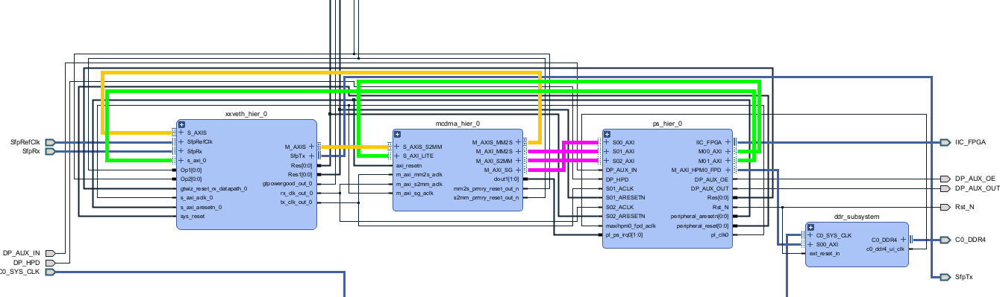

The reference clock and SFP pins are configured as external ports in the design. The clock is provided by a clock generator located on the baseboard, while the SFP pins are routed to an SFP cage on the baseboard, enabling Ethernet connectivity.  

The Ethernet IP and MCDMA IP are controlled via AXI interfaces, allowing the drivers to access and configure their registers. Additionally, the RX/TX channels of the MCDMA are connected to the processor through HP ports. This configuration allows the data stream to utilize a High Performance path.

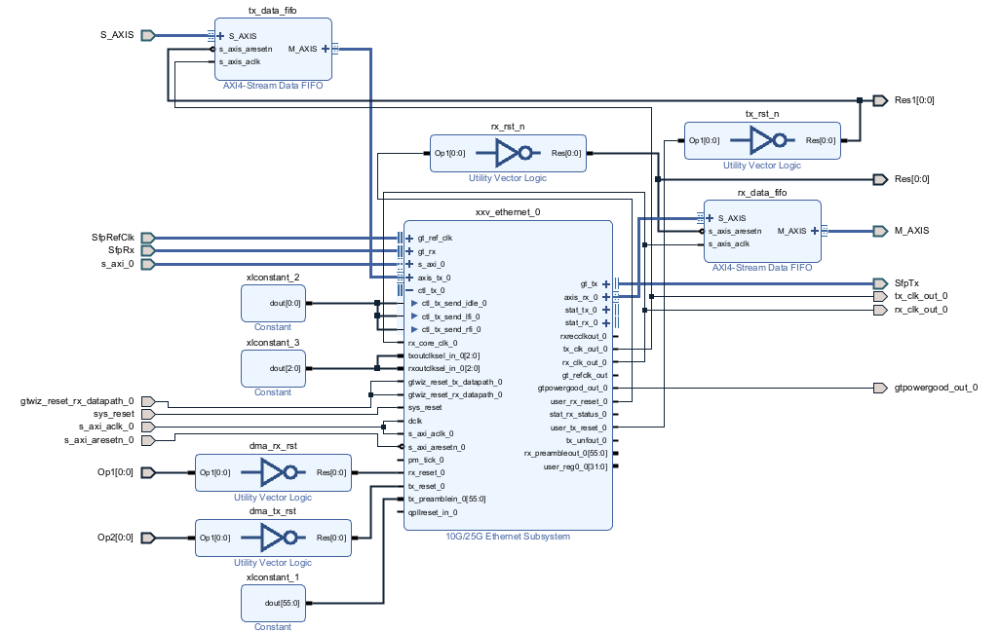

The 10G/25G Ethernet Subsystem IP operates alongside the AXI MCDMA IP to enable high-performance packet transmission and reception. Incoming packets are written to processor system memory via the S2MM (Stream to Memory Mapped) port, while outgoing packets are fetched from system memory using the MM2S (Memory Mapped to Stream) interface and transmitted over the SFP lines. The processor is notified of completed transmit and receive operations through MCDMA interrupts, allowing efficient synchronization and data flow management.

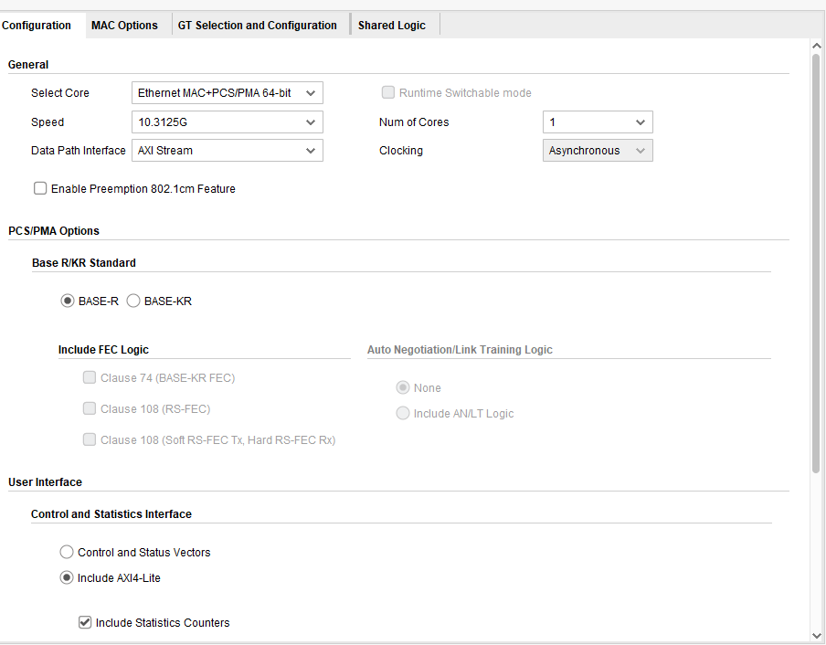

Apply configuration settings as shown above.

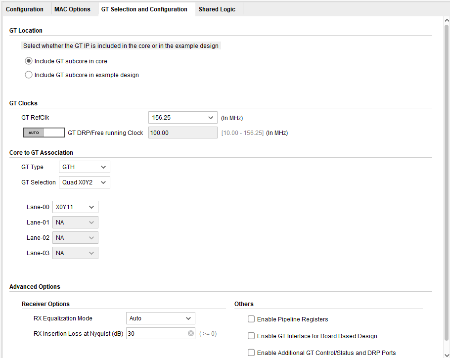

Apply GT Lane settings as shown above.

The GT location can be set to **"X0Y11"**, as the assigned pins for the SFP interface are mapped to this location. This ensures proper connectivity and alignment with the FPGA’s transceiver architecture.The remaining settings can be left at their default values.

### 4.1.2 Build Vivado Project

To build the project, open Vivado 2022.1 and access the TCL console. Navigate to the project directory and execute `create_project.tcl` to generate the block design. This script automates the creation of the hardware design.

```tcl
cd <base_directory_path>
source ./scripts/create_project.tcl
```
After generating bitstream, export the XSA file including the bitstream to ensure that the complete hardware design is available for integration with PetaLinux. Detailed instructions for this process can be found in the [reference design documentation](https://github.com/enclustra/Mercury_XU8_ST1_Reference_Design/tree/master/reference_design/doc).

## 4.2 PetaLinux Design 

PetaLinux is used to build a custom Linux system tailored for the Mercury+ XU8 module and ST1 baseboard, enabling seamless integration of the 10G Ethernet subsystem. After completing the firmware design in Vivado, the hardware configuration is exported as an .xsa file and imported into a PetaLinux project. This allows the system to generate the necessary device tree and hardware configuration.

PetaLinux Version: 2022.1

### 4.2.1 Project Creation from BSP

The PetaLinux project is generated using the pre-compiled BSP file for the XU8 module, which can be downloaded from the [official source](https://github.com/enclustra/Mercury_XU8_ST1_Reference_Design/releases). The boot method is set to SD Card, ensuring that the BSP file configures the project accordingly to support booting from a SD card. This setup simplifies the boot process and allows the system to load the Linux kernel, root filesystem, and device tree directly from the SD card.

Please follow [Enclustra BSP usage documentation](https://github.com/enclustra/PetalinuxDocumentation/blob/master/doc/BSP.md) in order to create PetaLinux project. 

After creating the PetaLinux project using the BSP, update the hardware to include the Ethernet design by running the following command:  

```bash
petalinux-config --get-hw-description=<path_to_xsa>
```

Replace `<path_to_xsa>` with the actual path to the exported `.xsa` file from Vivado. This ensures that the PetaLinux project is updated with the latest hardware configuration, including the Ethernet subsystem.

### 4.2.2 Device Tree

The device tree for the firmware design is automatically generated by the PetaLinux tool based on the hardware description from the `.xsa` file. This ensures that all peripherals, including the Ethernet subsystem, are correctly integrated into the Linux environment. The generated device tree defines 10G/25G Ethernet Subsystem along with its MCDMA configuration, specifying register addresses, interrupt assignments, and PHY mode.

```dts
mcdma_hier_0_axi_mcdma_0: axi_mcdma@80000000 {
    #dma-cells = <1>;
    clock-names = "s_axi_lite_aclk", "m_axi_sg_aclk", "m_axi_mm2s_aclk", "m_axi_s2mm_aclk";
    clocks = <&zynqmp_clk 71>, <&zynqmp_clk 71>, <&misc_clk_0>, <&misc_clk_0>;
    compatible = "xlnx,eth-dma";
    interrupt-names = "mm2s_ch1_introut", "mm2s_ch2_introut", "mm2s_ch3_introut", "mm2s_ch4_introut", "mm2s_ch5_introut", "mm2s_ch6_introut", "mm2s_ch7_introut", "mm2s_ch8_introut", "mm2s_ch9_introut", "mm2s_ch10_introut", "mm2s_ch11_introut", "mm2s_ch12_introut", "mm2s_ch13_introut", "mm2s_ch14_introut", "mm2s_ch15_introut", "mm2s_ch16_introut", "s2mm_ch1_introut", "s2mm_ch2_introut", "s2mm_ch3_introut", "s2mm_ch4_introut", "s2mm_ch5_introut", "s2mm_ch6_introut", "s2mm_ch7_introut", "s2mm_ch8_introut", "s2mm_ch9_introut", "s2mm_ch10_introut", "s2mm_ch11_introut", "s2mm_ch12_introut", "s2mm_ch13_introut", "s2mm_ch14_introut", "s2mm_ch15_introut", "s2mm_ch16_introut";
    interrupt-parent = <&gic>;
    interrupts = <0 89 4 0 89 4 0 89 4 0 89 4 0 89 4 0 89 4 0 89 4 0 89 4 0 89 4 0 89 4 0 89 4 0 89 4 0 89 4 0 89 4 0 89 4 0 89 4 0 90 4 0 90 4 0 90 4 0 90 4 0 90 4 0 90 4 0 90 4 0 90 4 0 90 4 0 90 4 0 90 4 0 90 4 0 90 4 0 90 4 0 90 4 0 90 4>;
    reg = <0x0 0x80000000 0x0 0x10000>;
    xlnx,addrwidth = /bits/ 8 <0x20>;
    xlnx,dlytmr-resolution = <0x7d>;
    xlnx,enable-single-intr = <0x0>;
    xlnx,group1-mm2s = <0xb71571c7>;
    xlnx,group1-s2mm = <0xb71571c7>;
    xlnx,group2-mm2s = <0x0>;
    xlnx,group2-s2mm = <0x0>;
    xlnx,group3-mm2s = <0x0>;
    xlnx,group3-s2mm = <0x0>;
    xlnx,group4-mm2s = <0x0>;
    xlnx,group4-s2mm = <0x0>;
    xlnx,group5-mm2s = <0x0>;
    xlnx,group5-s2mm = <0x0>;
    xlnx,group6-mm2s = <0x0>;
    xlnx,group6-s2mm = <0x0>;
    xlnx,include-dre ;
    xlnx,include-mm2s = <0x1>;
    xlnx,include-mm2s-dre = <0x1>;
    xlnx,include-mm2s-sf = <0x1>;
    xlnx,include-s2mm = <0x1>;
    xlnx,include-s2mm-dre = <0x1>;
    xlnx,include-s2mm-sf = <0x1>;
    xlnx,include-sg ;
    xlnx,mm2s-burst-size = <0x80>;
    xlnx,mm2s-scheduler = <0x2>;
    xlnx,num-mm2s-channels = <0x10>;
    xlnx,num-s2mm-channels = <0x10>;
    xlnx,prmry-is-aclk-async = <0x1>;
    xlnx,s2mm-burst-size = <0x80>;
    xlnx,sg-include-stscntrl-strm = <0x0>;
    xlnx,sg-length-width = <0x10>;
    xlnx,sg-use-stsapp-length = <0x0>;
};
misc_clk_0: misc_clk_0 {
    #clock-cells = <0>;
    clock-frequency = <156250000>;
    compatible = "fixed-clock";
};
xxveth_hier_0_xxv_ethernet_0: ethernet@80010000 {
    axistream-connected = <&mcdma_hier_0_axi_mcdma_0>;
    axistream-control-connected = <&mcdma_hier_0_axi_mcdma_0>;
    clock-frequency = <100000000>;
    clock-names = "rx_core_clk", "dclk", "s_axi_aclk", "s_axi_lite_aclk", "m_axi_sg_aclk", "m_axi_mm2s_aclk", "m_axi_s2mm_aclk";
    clocks = <&misc_clk_0>,  <&zynqmp_clk 71>,  <&zynqmp_clk 71>, <&zynqmp_clk 71>, <&zynqmp_clk 71>, <&misc_clk_0>, <&misc_clk_0>;
    compatible = "xlnx,xxv-ethernet-4.1", "xlnx,xxv-ethernet-1.0";
    device_type = "network";
    interrupt-names = "mm2s_ch1_introut", "mm2s_ch2_introut", "mm2s_ch3_introut", "mm2s_ch4_introut", "mm2s_ch5_introut", "mm2s_ch6_introut", "mm2s_ch7_introut", "mm2s_ch8_introut", "mm2s_ch9_introut", "mm2s_ch10_introut", "mm2s_ch11_introut", "mm2s_ch12_introut", "mm2s_ch13_introut", "mm2s_ch14_introut", "mm2s_ch15_introut", "mm2s_ch16_introut", "s2mm_ch1_introut", "s2mm_ch2_introut", "s2mm_ch3_introut", "s2mm_ch4_introut", "s2mm_ch5_introut", "s2mm_ch6_introut", "s2mm_ch7_introut", "s2mm_ch8_introut", "s2mm_ch9_introut", "s2mm_ch10_introut", "s2mm_ch11_introut", "s2mm_ch12_introut", "s2mm_ch13_introut", "s2mm_ch14_introut", "s2mm_ch15_introut", "s2mm_ch16_introut";
    interrupt-parent = <&gic>;
    interrupts = <0 89 4 0 89 4 0 89 4 0 89 4 0 89 4 0 89 4 0 89 4 0 89 4 0 89 4 0 89 4 0 89 4 0 89 4 0 89 4 0 89 4 0 89 4 0 89 4 0 90 4 0 90 4 0 90 4 0 90 4 0 90 4 0 90 4 0 90 4 0 90 4 0 90 4 0 90 4 0 90 4 0 90 4 0 90 4 0 90 4 0 90 4 0 90 4>;
    local-mac-address = [00 0a 35 00 00 02];
    phy-mode = "base-r";
    reg = <0x0 0x80010000 0x0 0x10000>;
    xlnx = <0x0>;
    xlnx,add-gt-cntrl-sts-ports = <0x0>;
    xlnx,anlt-clk-in-mhz = <0x64>;
    xlnx,axis-tdata-width = <0x40>;
    xlnx,axis-tkeep-width = <0x7>;
    xlnx,base-r-kr = "BASE-R";
    xlnx,channel-ids = "1","2","3","4","5","6","7","8","9","a","b","c","d","e","f","10";
    xlnx,clocking = "Asynchronous";
    xlnx,cmac-core-select = "CMACE4_X0Y0";
    xlnx,core = "Ethernet MAC+PCS/PMA 64-bit";
    xlnx,data-path-interface = "AXI Stream";
    xlnx,enable-datapath-parity = <0x0>;
    xlnx,enable-gt-board-interface = <0x0>;
    xlnx,enable-pipeline-reg = <0x0>;
    xlnx,enable-preemption = <0x0>;
    xlnx,enable-preemption-fifo = <0x0>;
    xlnx,enable-rx-flow-control-logic = <0x0>;
    xlnx,enable-time-stamping = <0x0>;
    xlnx,enable-tx-flow-control-logic = <0x0>;
    xlnx,enable-vlane-adjust-mode = <0x0>;
    xlnx,family-chk = "zynquplus";
    xlnx,fast-sim-mode = <0x0>;
    xlnx,gt-diffctrl-width = <0x4>;
    xlnx,gt-drp-clk = "100.00";
    xlnx,gt-group-select = "Quad X0Y0";
    xlnx,gt-location = <0x1>;
    xlnx,gt-ref-clk-freq = "156.25";
    xlnx,gt-type = "GTH";
    xlnx,gtm-group-select = "NA";
    xlnx,include-auto-neg-lt-logic = "None";
    xlnx,include-axi4-interface = <0x1>;
    xlnx,include-dre ;
    xlnx,include-fec-logic = <0x0>;
    xlnx,include-hybrid-cmac-rsfec-logic = <0x0>;
    xlnx,include-rsfec-logic = <0x0>;
    xlnx,include-shared-logic = <0x1>;
    xlnx,include-statistics-counters = <0x1>;
    xlnx,include-user-fifo = <0x1>;
    xlnx,ins-loss-nyq = <0x1e>;
    xlnx,lane1-gt-loc = "X0Y11";
    xlnx,lane2-gt-loc = "NA";
    xlnx,lane3-gt-loc = "NA";
    xlnx,lane4-gt-loc = "NA";
    xlnx,line-rate = <0xa>;
    xlnx,mii-ctrl-width = <0x4>;
    xlnx,mii-data-width = <0x20>;
    xlnx,num-of-cores = <0x1>;
    xlnx,num-queues = /bits/ 16 <0x10>;
    xlnx,ptp-clocking-mode = <0x0>;
    xlnx,ptp-operation-mode = <0x2>;
    xlnx,runtime-switch = <0x0>;
    xlnx,rx-eq-mode = "AUTO";
    xlnx,rxmem = <0x40000>;
    xlnx,statistics-regs-type = <0x0>;
    xlnx,switch-1-10-25g = <0x0>;
    xlnx,sys-clk = <0xfa0>;
    xlnx,tx-latency-adjust = <0x0>;
    xlnx,tx-total-bytes-width = <0x4>;
    xlnx,xgmii-interface = <0x1>;
    zclock-names = "NULL";
    zclocks = "NULL";
    xxveth_hier_0_xxv_ethernet_0_mdio: mdio {
        #address-cells = <1>;
        #size-cells = <0>;
    };
};
```

### 4.2.3 FSBL Modification

The Ethernet IP requires a stable reference clock to operate at the specified frequency. This clock is provided by the Si5338 clock generator (component U800) on the ST1 board. Before the PL design is loaded into memory, the clock generator must be programmed to ensure it delivers the correct output frequency. It is configured to provide the required frequency through its differential output (CLK3), which is routed to the XU8 module and then to the Ethernet IP within the PL design.

To achieve this, a [patch](code/10G_PL_SFP/petalinux/project-spec/meta-user/recipes-bsp/embeddedsw/files/0001-ClockGen-156-25Mhz-programming.patch) which sets the clock 156.25 MHz located in the [`/embeddedsw`](code/10G_PL_SFP/petalinux/project-spec/meta-user/recipes-bsp) directory modify the FSBL source code to program the clock generator before the FPGA bitstream is loaded. This patch adjusts the required register values, ensuring that the Ethernet subsystem receives a stable and accurate clock signal from the start.

If a different clock frequency is required, [ClockBuilderPro](https://www.skyworksinc.com/en/Application-Pages/Clockbuilder-Pro-Software) software can be used to generate a new C file with updated register settings. The generated register map should then replace the existing data in the `Si5338_register_map.h` file to apply the new configuration.

**NOTE** : Copy the `embeddedsw` folder into the `recipes-bsp` directory of the PetaLinux project.  


### 4.2.4 Kernel Configuration  
The kernel driver connects to the Ethernet subsystem through the device tree, which provides the necessary hardware information to the Linux kernel. During boot, the kernel parses the device tree to locate and initialize 10G/25G Ethernet Subsystem and its associated MCDMA controller.  

The driver matches the hardware using the compatible string defined in the device tree. When the kernel detects a node with a matching compatible string, it loads the corresponding driver and maps the memory regions, interrupt lines, and other required resources. The driver also reads additional properties such as PHY mode, base addresses, and MCDMA configuration to properly initialize the Ethernet subsystem.  

Once the driver is loaded, it registers itself with the Linux network stack, enabling user-space applications to interact with the Ethernet interface through standard networking APIs.

The following config options should be enabled in order to build the Ethernet driver. However, these configurations are enabled by default in this example except `CONFIG_AXIENET_HAS_MCDMA`. It should be enabled manually.  
```
CONFIG_ETHERNET  
CONFIG_NET_VENDOR_XILINX  
CONFIG_XILINX_AXI_EMAC  
CONFIG_XILINX_PHY  
CONFIG_AXIENET_HAS_MCDMA  
```

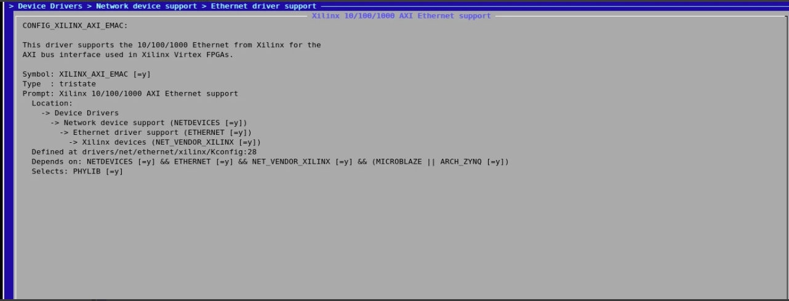<br>

## 4.3 Linux 

This application note provides a step-by-step guide to test the SFP-based Ethernet connection on a Linux system using the `iperf3` tool. The procedure verifies link stability, bandwidth performance, and data transmission reliability between connected devices.

### 4.3.1 Prerequisites
Before running the test, ensure the following:
- Host PC with compatible 10G NIC
- Compatible 10BASE-T or 10BASE-R SFP modules ([used SFP module in this example](https://www.fs.com/de/products/66612.html))
- Compatible Cat6/6a cable(copper or optical)  with SFP modules
- `iperf3` installed on both systems

### 4.3.2 Testing
#### Step 1: Verify SFP Link Status 
Before running `iperf3` on the host system, check the status of the link. PetaLinux 2022.1 does not support `ethtool` for 10G/25G Ethernet IP so this command will not show expected output on the client.

Check link status:
   ```bash
   ethtool enp6s0f0
   ```
   Ensure that `Link detected: yes` and the correct speed `10000Mb/s` is displayed.

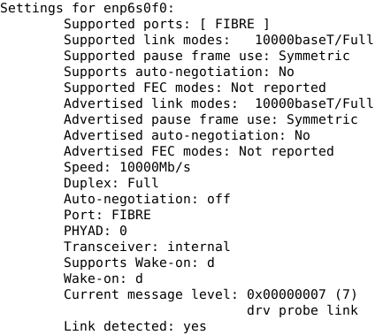

#### Step 2: Configure IP Address
Assign static IP address.

On the FPGA module:
```bash
ifconfig eth2 192.168.2.100
```

On the host system:
```bash
ifconfig eth0 192.168.2.10
```

Check connectivity by pinging from client to host
```bash
ping 192.168.2.10
```

#### Step 3: Optimize Settings to Maximize Bandwidth Measurement Performance

1. Increase MTU to jumbo frame size
 * On the FPGA module
     ```bash
     ip link set down dev eth2
     ip link set dev eth2 mtu 9000
     ip link set up dev eth2
     ifconfig eth2 192.168.2.100
     ```
 * On the host
     ```bash
     ip link set down dev enp6s0f0
     ip link set dev enp6s0f0 mtu 9000
     ip link set up dev enp6s0f0
     ifconfig enp6s0f0 192.168.2.10
     ```

2. Set Ethernet Multi Channel DMA (MCDMA) TX interrupt to core-1 to increase the performance on the client. Interrupt numbers can be checked using
    ```bash
    cat /proc/interrupts
    ```
    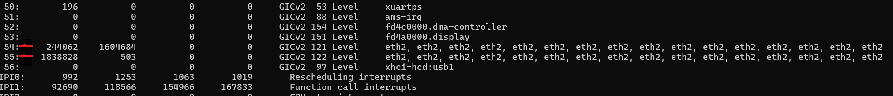

    TX interrupt number is 54.
    ```bash
    echo 2 > /proc/irq/54/smp_affinity
    ```

#### Step 4: Run iperf3 Servers

Multiple iperf3 server instances are run on the server, each assigned to a different port to handle multiple client connections simultaneously.
```bash
    iperf3 -s -p 5101 &
    iperf3 -s -p 5102 &
    iperf3 -s -p 5103 &
```

#### Step 5: Run iperf3 Clients
Multiple iperf3 client instances are executed on the client, with each client application assigned to an idle CPU core to optimize performance.
```bash
    taskset -c 0 iperf3 -c 192.168.2.10 -T s1 -p 5101 &
    taskset -c 2 iperf3 -c 192.168.2.10 -T s2 -p 5102 &
    taskset -c 3 iperf3 -c 192.168.2.10 -T s3 -p 5103 &
```

#### Step 6: Measure CPU usage
Run `mpstat` tool to track CPU utilization on the client.
```bash
   ./mpstat -P ALL 1
```

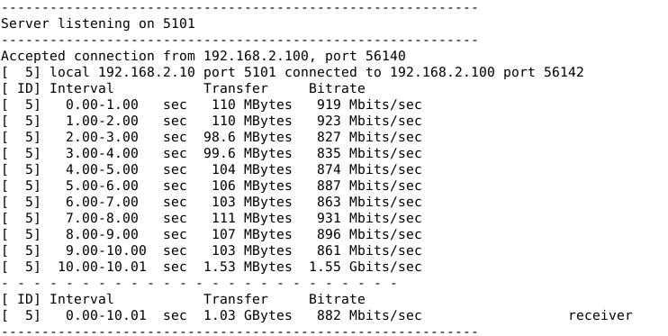

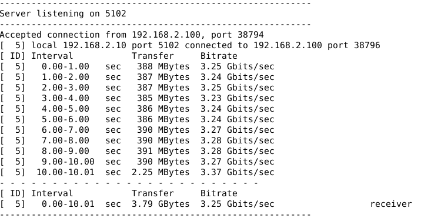

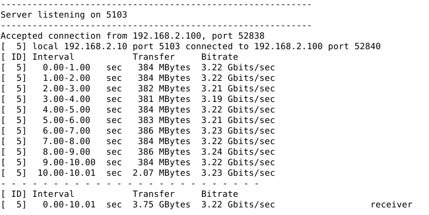

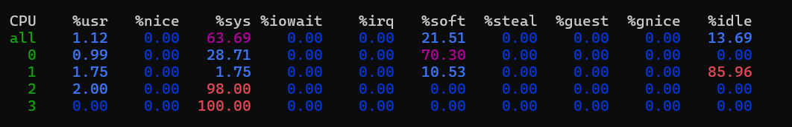

**Measured Speed**    : 7.35 Gbps  
**Measured CPU Usage**: %86.31


**Please continue reading chapter 5 [GMII to RGMII](./Chapter-5-GMII_to_RGMII.md)**