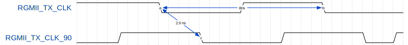

# 5 GMII to RGMII converter

The GMII to RGMII converter is provided by Enclustra as netlist. The netlist is included in the Vivado reference designs for modules equipped with an Ethernet PHY connected via RGMII interface to the programmable logic. The converter does not use internal delay blocks (IDELAY primitives) and can be used for RGMII interfaces connected to HD IO banks. For HP IO banks, the [Xilinx GMII to RGMII LogiCORE](https://www.xilinx.com/products/intellectual-property/gmii-to-rgmii.html) is preferred.

Supported features:
- Speed: 10/100/1000 Mbps
- Automatic speed detection
- Only for Ultrascale+ architecture

Two different netlists are available. The difference between these netlists is that one of them can be used with an inverted receive clock (RGMII_rxclk).

## 5.1 Affected Modules/Reference Designs
On a few Enclustra modules, the Ethernet PHY is connected to the PL HD bank, while the Ethernet MAC controller is implemented in the PS. In this configuration, the GMII interface from the MAC is routed through EMIO pins to the PL, where it connects to the external PHY.

- Mercury XU5 (KSZ9031)
- Andromeda XZU65 (KSZ9131)
- Andromeda XZU80 (KSZ9031)
- Andromeda XZU90-R1 (KSZ9031 / RGMII RX clock is not connected to a clock capable input)
- Andromeda XRU50 (KSZ9131)

## 5.2 Block Diagram


## 5.3 Clocking

Four input clocks are required for operation. All clocks must be stable before reset is released. Clk25 (25MHz) and Clk10 (10MHz) are used for 10/100Mbps operation while Clk125 (125MHz) clocks the internal logic. Clk125_90 (125MHz) is phase shifted and is only used for the output registers of RGMII_txd and RGMII_txctl. All input clocks must be phase synchronous (= generated by the same PLL).

| Name            | Generics Description      |
|-----------------|---------------------------|
| RX_CLK_POLARITY | 'true' to invert RX clock |

RX_CLK_POLARITY must be 'true' for XU5 and XZU65 modules.

## 5.4 VHDL Component Declaration

```
component en_gmii2rgmii is
    port (
        Clk125                : in  std_logic;
        Clk125_90             : in  std_logic;
        Clk25                 : in  std_logic;
        Clk10                 : in  std_logic;
        Resetn                : in  std_logic;

        GMII_col              : out std_logic;
        GMII_crs              : out std_logic;
        GMII_rx_clk           : out std_logic;
        GMII_rx_dv            : out std_logic;
        GMII_rx_er            : out std_logic;
        GMII_rxd              : out std_logic_vector(7 downto 0);
        GMII_speed_mode       : in  std_logic_vector(2 downto 0);
        GMII_tx_clk           : out std_logic;
        GMII_tx_en            : in  std_logic;
        GMII_tx_er            : in  std_logic;
        GMII_txd              : in  std_logic_vector(7 downto 0);

        RGMII_rxd             : in  std_logic_vector(3 downto 0);
        RGMII_rxclk           : in  std_logic;
        RGMII_rxctl           : in  std_logic;
        RGMII_txd             : out std_logic_vector(3 downto 0);
        RGMII_txclk           : out std_logic;
        RGMII_txctl           : out std_logic;

        Speed1000En           : out std_logic;
        Speed100En            : out std_logic;
        Speed10En             : out std_logic
  );
end component en_gmii2rgmii;
```

## 5.5 Signal Description

| Signal Name | Direction | Clock  | Description |
|-------------|-----------|--------|-------------|
| Clk125      | in        | -      | 125 MHz input clock |
| Clk125_90   | in        | -      | 125 MHz input clock (90° phase shifted, used for RGMII_txd and RGMII_txctl output registers) |
| Clk25       | in        | -      | 25 MHz input clock |
| Clk10       | in        | -      | 10 MHz input clock |
| Resetn      | in        | Clk125 | Synchronous, active low reset input |
| GMII_*      | n/a       | Clk125 | GMII interface to be connected to EMIO interface of GEM controller (see [here](https://docs.xilinx.com/r/en-US/ug1085-zynq-ultrascale-trm/GMII/MII-Interface-via-EMIO)) |
| RGMII_*     | n/a       | -      | RGMII interface to be connected to I/O ports |
| Speed1000En | out       | Clk125 | Interface is operating with 1 Gbps |
| Speed100En  | out       | Clk125 | Interface is operating with 100 Mbps |
| Speed10En   | out       | Clk125 | Interface is operating with 10 Mbps |

## 5.6 Timing Constraints Description

Following section describes the timing constraints used in the XU5 reference design (release 2022.1). Other reference designs might contain minor differences, but use the same concept.

### RX

For the receive path, two clocks need to be created. RGMII_RX_CLK_VIRT is a virtual clock synchronous to the receive data (rxd*, rxctl). RGMII_RX_CLK is the phase shifted receive clock according to the setting configured in the Ethernet PHY.
Note that no negative numbers can be entered (e.g. -0.18ns need to be represented by adding a full clock period: -0.18ns + 8.0ns = 7.82ns).

```
create_clock -period 8.000 -name RGMII_RX_CLK -waveform {7.82 11.82} [get_ports ETH1_RXCLK]
create_clock -name RGMII_RX_CLK_VIRT -period 8.000
```


The input delay of the receive data is constrained for 0.5ns setup and 0.5ns hold time.

```
set_input_delay -clock {RGMII_RX_CLK_VIRT} -min -0.5 [get_ports {ETH1_RXD[0] ETH1_RXD[1] ETH1_RXD[2] ETH1_RXD[3] ETH1_RXCTL}] -add_delay
set_input_delay -clock {RGMII_RX_CLK_VIRT} -max 0.5 [get_ports {ETH1_RXD[0] ETH1_RXD[1] ETH1_RXD[2] ETH1_RXD[3] ETH1_RXCTL}] -add_delay
set_input_delay -clock {RGMII_RX_CLK_VIRT} -clock_fall -min -0.5 [get_ports {ETH1_RXD[0] ETH1_RXD[1] ETH1_RXD[2] ETH1_RXD[3] ETH1_RXCTL}] -add_delay
set_input_delay -clock {RGMII_RX_CLK_VIRT} -clock_fall -max 0.5 [get_ports {ETH1_RXD[0] ETH1_RXD[1] ETH1_RXD[2] ETH1_RXD[3] ETH1_RXCTL}] -add_delay
```

The image below shows the relevant edges for setup and hold time analysis. For setup, falling edge to falling edge and rising edge to rising edge do not have to be checked by the timing analyzer. Same for rising edge to falling edge and falling edge to rising edge for hold time analysis.


False path constraints need to be added to prevent Vivado from checking the timing between these clock edges.

```
set_false_path -rise_from [get_clocks RGMII_RX_CLK_VIRT] -rise_to [get_clocks RGMII_RX_CLK] -setup
set_false_path -fall_from [get_clocks RGMII_RX_CLK_VIRT] -fall_to [get_clocks RGMII_RX_CLK] -setup
set_false_path -rise_from [get_clocks RGMII_RX_CLK_VIRT] -fall_to [get_clocks RGMII_RX_CLK] -hold
set_false_path -fall_from [get_clocks RGMII_RX_CLK_VIRT] -rise_to [get_clocks RGMII_RX_CLK] -hold
```

### TX

Two clocks are required for the transmit path. RGMII_TX_CLK is the source clock for the data and is created by a PLL. Vivado automatically creates a clock named "clk_out1_Mercury_XU5_clk_wiz_0_0". This clock is assigned to a variable named "RGMII_TX_CLK" for easier usage. The second clock "RGMII_TX_CLK_90" is the 90° phase shifted clock at the output port ETH1_TXCLK.

```
set RGMII_TX_CLK  "clk_out1_Mercury_XU5_clk_wiz_0_0"
create_generated_clock -name RGMII_TX_CLK_90 -source [get_pins Mercury_XU5_i/clk_wiz_0/clk_out2] -multiply_by 1 [get_ports ETH1_TXCLK]
```



To make sure the 90° phase shift is preserved at the clock input of the ODDR registers, both transmit clocks must be added to the same clock delay group. Note that the CLOCK_DELAY_GROUP constraint must be applied to the output of the clock buffer.

```
set_property CLOCK_DELAY_GROUP rgmii_tx_group [get_nets -of_objects [get_pins Mercury_XU5_i/clk_wiz_0/inst/clkout1_buf/O] ]
set_property CLOCK_DELAY_GROUP rgmii_tx_group [get_nets -of_objects [get_pins Mercury_XU5_i/clk_wiz_0/inst/clkout2_buf/O] ]
```

The output delay for transmit data is constrained for 1.0ns setup and 1.0ns hold time.

```
set_output_delay -clock {RGMII_TX_CLK_90} -min -1.0 [get_ports {ETH1_TXD[0] ETH1_TXD[1] ETH1_TXD[2] ETH1_TXD[3] ETH1_TXCTL}] -add_delay
set_output_delay -clock {RGMII_TX_CLK_90} -max 1.0 [get_ports {ETH1_TXD[0] ETH1_TXD[1] ETH1_TXD[2] ETH1_TXD[3] ETH1_TXCTL}] -add_delay
set_output_delay -clock {RGMII_TX_CLK_90} -clock_fall -min -1.0 [get_ports {ETH1_TXD[0] ETH1_TXD[1] ETH1_TXD[2] ETH1_TXD[3] ETH1_TXCTL}] -add_delay
set_output_delay -clock {RGMII_TX_CLK_90} -clock_fall -max 1.0 [get_ports {ETH1_TXD[0] ETH1_TXD[1] ETH1_TXD[2] ETH1_TXD[3] ETH1_TXCTL}] -add_delay
```

The image below shows the relevant edges for setup and hold time analysis. For setup, falling edge to rising edge and rising edge to falling edge do not have to be checked by the timing analyzer. Same for rising edge to rising edge and falling edge to falling edge for hold time analysis.


False path constraints need to be added to prevent Vivado from checking the timing between these clock edges.

```
set_false_path -rise_from [get_clocks $RGMII_TX_CLK] -fall_to [get_clocks RGMII_TX_CLK_90] -setup
set_false_path -fall_from [get_clocks $RGMII_TX_CLK] -rise_to [get_clocks RGMII_TX_CLK_90] -setup
set_false_path -rise_from [get_clocks $RGMII_TX_CLK] -rise_to [get_clocks RGMII_TX_CLK_90] -hold
set_false_path -fall_from [get_clocks $RGMII_TX_CLK] -fall_to [get_clocks RGMII_TX_CLK_90] -hold
```

Because the transmit clock is phase shifted, the analyzed edge for the setup path must be moved back by one clock period. The hold path is not affected by the phase shift. Following image shows the wrongly analyzed edges without multicycle paths.


Following multicycle path constraints move the analyzed setup path by one clock cycle.

```
set_multicycle_path -fall_from [get_clocks $RGMII_TX_CLK] -fall_to [get_clocks RGMII_TX_CLK_90] -setup -start 0
set_multicycle_path -rise_from [get_clocks $RGMII_TX_CLK] -rise_to [get_clocks RGMII_TX_CLK_90] -setup -start 0
set_multicycle_path -rise_from [get_clocks $RGMII_TX_CLK] -fall_to [get_clocks RGMII_TX_CLK_90] -hold -start 0
set_multicycle_path -fall_from [get_clocks $RGMII_TX_CLK] -rise_to [get_clocks RGMII_TX_CLK_90] -hold -start 0
```

## 5.7 Placement Constraints Description

Because the routing delay of the clock signal increases when the clock signal crosses a boundary to a different clock region, the GMII to RGMII converter design is forced to be placed in a single clock region.
The clock region is given by the IO bank where the RGMII interface is placed. The receive clock port RGMII_RX_CLK (port G11) is used to retrieve the clock region.

```
create_pblock pblock_gmii_to_rgmii
add_cells_to_pblock [get_pblocks pblock_gmii_to_rgmii] [get_cells -quiet [list i_gmii2rgmii]]
resize_pblock [get_pblocks pblock_gmii_to_rgmii] -add CLOCKREGION_[get_clock_regions -of_objects [get_sites G11]]
set_property CONTAIN_ROUTING true [get_pblocks pblock_gmii_to_rgmii]
```

## 5.8 PHY Delay Configuration

### Microchip KSZ9031

With the default settings, when no additional delay is configured, the RGMII RX clock is delayed by 1.2 ns compared to the RX data. This delay is added inside the Ethernet PHY. No delay is added between RGMII TX clock and TX data.
Additional delay can be added to the RGMII data and clock signals as follows:

- RX clock and TX clock can be delayed in the range -0.9ns .. +0.96ns in 32 steps.
- RX and TX data can be delayed in the range -0.42ns .. +0.48ns in 16 steps.

The minium delay is when the clock is configured to its minimum value and data to its maximum value:
1.2ns - 0.9ns - 0.48ns = -0.18ns

The maximum delay is when the clock is configured to its maximum value and the data to its minimum value:
1.2ns +0.9ns +0.42ns = +2.52ns

See section 3.9.3 in the [KSZ9031NX datasheet](http://ww1.microchip.com/downloads/en/devicedoc/00002117f.pdf) for more information and a detailed register description.

See chapter 2 [PHY configuration](Chapter-2-PHY_configuration.md) for a description of how to configure the PHY delay values.

#### Configuration via devicetree
The delay can be configured in the devicetree as shown below (note that the delay values do not represent negative numbers and therefore, 900ps is added to all clocks and 420ps is added to the data).

```dts
phy1: phy@3 {
	reg = <3>;

	// 0 ns TX clock delay
	txc-skew-ps = <900>;
	txen-skew-ps = <420>;
	txd0-skew-ps = <420>;
	txd1-skew-ps = <420>;
	txd2-skew-ps = <420>;
	txd3-skew-ps = <420>;

	// 1.2ns - 1.38ns = -0.18ns RX clock delay
	rxc-skew-ps = <0>;
	rxdv-skew-ps = <900>;
	rxd0-skew-ps = <900>;
	rxd1-skew-ps = <900>;
	rxd2-skew-ps = <900>;
	rxd3-skew-ps = <900>;
};
```

### Microchip KSZ9131

By default, the RGMII RX clock is delayed by 2.0 ns compared to RX data. No delay is added between RGMII TX clock and TX data. Additional delay can be added to the RGMII data and clock signals:
- RX clock and TX clock can be delayed in the range -0.41ns .. +1.39ns in 32 steps.    
- RX and TX data can be delayed in the range -0.51ns .. +0.58ns in 16 steps.

RX and TX clock can be shifted between -0.99ns to 3.9ns.

See section 4.9.3.2 in the [KSZ9131NX datasheet](https://ww1.microchip.com/downloads/aemDocuments/documents/UNG/ProductDocuments/DataSheets/00002841D.pdf) for more information and a detailed register description.

#### Configuration via devicetree
The delay can be configured in the devicetree as shown below.
The 2.0 ns DLL delay can  be configured through the "phy-mode" property as follows:
- "rgmii" = disable TX and RX delay
- "rgmii-id" = enable both RX and TX delay
- "rgmii-rxid" = enable only RX delay
- "rgmii-txid" = Enable only TX delay

The delay values in the devicetree are the register values to be written into the PHY register -7 multiplied with 100.

```dts
&gem1 {

	// disable DLL delay
	phy-mode = "rgmii";
	
	phy7: phy@7 {
		reg = <7>;

		// 0 ns TX clock delay
		txc-skew-psec = <0>;
		txen-skew-psec = <0>;
		txd0-skew-psec = <0>;
		txd1-skew-psec = <0>;
		txd2-skew-psec = <0>;
		txd3-skew-psec = <0>;
	
		// -0.29 ns RX clock delay
		rxc-skew-psec = <(-700)>;
		rxdv-skew-psec = <0>;
		rxd0-skew-psec = <0>;
		rxd1-skew-psec = <0>;
		rxd2-skew-psec = <0>;
		rxd3-skew-psec = <0>;
	};
};
```


## 5.9 Tips when Timing Constraints are not met

### Check Clock Buffer Placement

Sometimes Vivado places the clock buffer for the RGMII_RX_CLK signal far away from the input port and the IDDR registers. This adds additional delay to the clock routing which results in timing errors. An example can be seen in the following image.


When the converter is placed in the same clock region as the receive clock input port (see section [Placement Constraints Description](./Chapter-3-GMII_to_RGMII.md#36-placement-constraints-description)), further clock buffer placement should not be required. Otherwise, the clock buffer for the RGMII receive clock can be placed manually to move it closer to the clock input port and IDDR registers by adding following constraints:

```
set_property BEL BUFCE [get_cells i_gmii2rgmii/i_rgmii_rxclk_buf]
set_property LOC BUFGCE_HDIO_X0Y3 [get_cells i_gmii2rgmii/i_rgmii_rxclk_buf]
```

The buffer location depends on the Ultrascale+ device and needs to be selected in the Vivado floorplanning tool.

### Remove Placement Constraints

When timing errors occur between input/output signals of the processing system and a register in the programmable logic, the placement of the GMII to RGMII converter might be too far away from the location of the processing system. In that case it helps to remove following constraints.

```
create_pblock pblock_gmii_to_rgmii
add_cells_to_pblock [get_pblocks pblock_gmii_to_rgmii] [get_cells -quiet [list i_gmii2rgmii]]
resize_pblock [get_pblocks pblock_gmii_to_rgmii] -add CLOCKREGION_[get_clock_regions -of_objects [get_sites G11]]
set_property CONTAIN_ROUTING true [get_pblocks pblock_gmii_to_rgmii]
```

### Adjust Delay between Clock and Data

If the setup or hold time of RGMII receive input signals is violated, the delay between clock and data can be adjusted by modifying the delay setting of the Ethernet PHY.

#### Setup Time Violation

If setup time violation is reported as shown in following image, the delay of the receive clock must be increased.


This is done by modifying the constraints of the ETH1_RXCLK signal. Following example adds 0.48ns delay compared to the setting described in section [RX](#rx).

```diff
-create_clock -period 8.000 -name RGMII_RX_CLK -waveform {7.82 11.82} [get_ports ETH1_RXCLK]
+create_clock -period 8.000 -name RGMII_RX_CLK -waveform {0.30 4.30} [get_ports ETH1_RXCLK]
create_clock -name RGMII_RX_CLK_VIRT -period 8.000
```

Because the delay change crosses the 0ns boundary, the relationship of the clock edges between clock (ETH_RX_CLK) and data (RGMII_RX_CLK_VIRT) changes. This affects the hold time check but not setup check. The analyzed clock edge for RGMII_RX_CLK needs to be adjusted by adding a multicycle constraint as shown below.

```
set_multicycle_path -rise_from [get_clocks RGMII_RX_CLK_VIRT] -rise_to [get_clocks RGMII_RX_CLK] -hold -end -1
set_multicycle_path -fall_from [get_clocks RGMII_RX_CLK_VIRT] -fall_to [get_clocks RGMII_RX_CLK] -hold -end -1
```

In addition to the changes on the timing constraints, the Ethernet PHY needs to be configured with the same delay. For example the RX clock delay is increased by 480ps in the devicetree.

```diff
phy1: phy@3 {
    reg = <3>;
    txc-skew-ps = <900>;
    txen-skew-ps = <420>;
    txd0-skew-ps = <420>;
    txd1-skew-ps = <420>;
    txd2-skew-ps = <420>;
    txd3-skew-ps = <420>;
-   rxc-skew-ps = <0>;
+   rxc-skew-ps = <480>;
    rxdv-skew-ps = <900>;
    rxd0-skew-ps = <900>;
    rxd1-skew-ps = <900>;
    rxd2-skew-ps = <900>;
    rxd3-skew-ps = <900>;
};
```

#### Hold Time Violation

If hold time violation is reported as shown in following image, the delay of the receive clock must be decreased.


Unfortunately this is not possible in the reference design because the delay can't be decreased further than -0.18ns.
But for completion of this document, the following description assumes this is possible. According to the timing report, the receive clock delay should be decreased by 0.5ns for equal setup and hold slack.

```diff
-create_clock -period 8.000 -name RGMII_RX_CLK -waveform {7.82 11.82} [get_ports ETH1_RXCLK]
+create_clock -period 8.000 -name RGMII_RX_CLK -waveform {7.32 11.32} [get_ports ETH1_RXCLK]
create_clock -name RGMII_RX_CLK_VIRT -period 8.000
```

Similar to section [Setup Time Violation](#setup-time-violation), the delay settings of the Ethernet PHY need to be adjusted by the same value.

### Enable Fast Slew Rate

If the timing closure for the RGMII TX signals are not met, fast slew rate can be enabled by adding following settings.
In addition to that, the lowest possible I/O voltage should be used for the I/O bank where the RGMII signals are connected to.

```
set_property SLEW FAST [get_ports {ETH1_TXD[0]}]
set_property SLEW FAST [get_ports {ETH1_TXD[1]}]
set_property SLEW FAST [get_ports {ETH1_TXD[2]}]
set_property SLEW FAST [get_ports {ETH1_TXD[3]}]
set_property SLEW FAST [get_ports {ETH1_TXCTL}]
set_property SLEW FAST [get_ports {ETH1_TXCLK}]
```

## 5.10 Variation between different Enclustra modules

### Andromeda XZU90

On the Andromeda XZU90 module the RGMII_RX_CLK signal is not connected to a clock capable input port. Because of that, the clock signal can not be routed through dedicated clocking resources in the FPGA fabric.
An additional constraint is required to allow this suboptimal clock routing.

```
set_property CLOCK_DEDICATED_ROUTE FALSE [get_nets ETH1_RXCLK_IBUF_inst/O]
```

This clock routing adds additional delay to the receive clock signal (approx. 3 ns). It is not possible to reduce this delay, but the clock delay can be increased by approx. 5 ns to add a full clock period of delay. 4 ns can be added by inverting the receive clock and 1 ns can be added as delay in the Ethernet PHY.

To be able to meet the timing, the receive clock delay is set to +1.14 ns in the Ethernet PHY.

```diff
-create_clock -period 8.000 -name RGMII_RX_CLK -waveform {7.82 11.82} [get_ports ETH1_RXCLK]
+create_clock -period 8.000 -name RGMII_RX_CLK -waveform {1.140 5.140} [get_ports ETH1_RXCLK]
```

This results in following change. Note that for clock edge 'b' on ETH1_RXCLK, data c is captured.


The placement constraints need to be removed because the converter is placed too far away from the processing system. Placing all GMII to RGMII converter registers in the clock region of the input ports causes errors in the transmit path.
However the clock buffer is still required to be placed in the same clock region.

```diff
create_pblock pblock_gmii_to_rgmii
-add_cells_to_pblock [get_pblocks pblock_gmii_to_rgmii] [get_cells -quiet [list i_gmii2rgmii]]
+add_cells_to_pblock [get_pblocks pblock_gmii_to_rgmii] [get_cells i_gmii2rgmii/i_rgmii_rxclk_buf]
resize_pblock [get_pblocks pblock_gmii_to_rgmii] -add CLOCKREGION_[get_clock_regions -of_objects [get_sites J12]]
-set_property CONTAIN_ROUTING true [get_pblocks pblock_gmii_to_rgmii]
```


**Please continue reading chapter 6 [PS Ethernet](./Chapter-6-PS-Ethernet.md)**