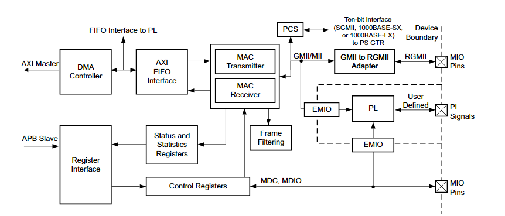
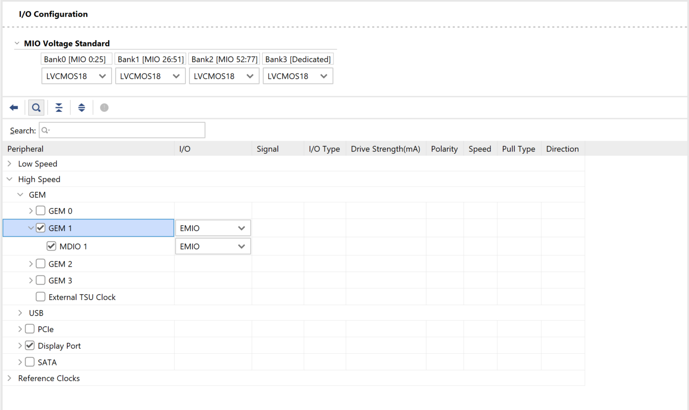
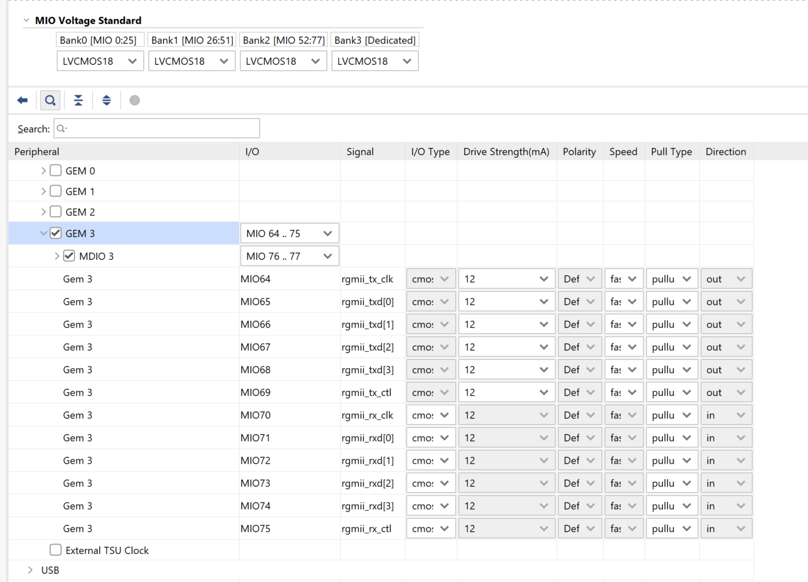
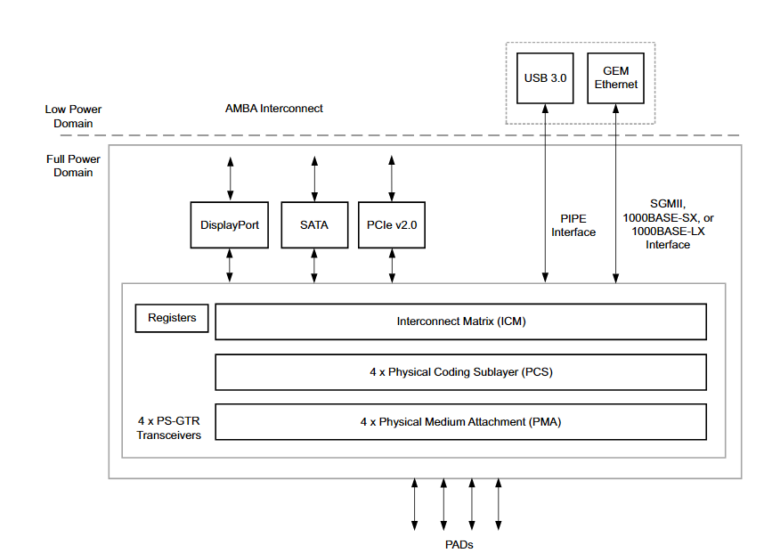
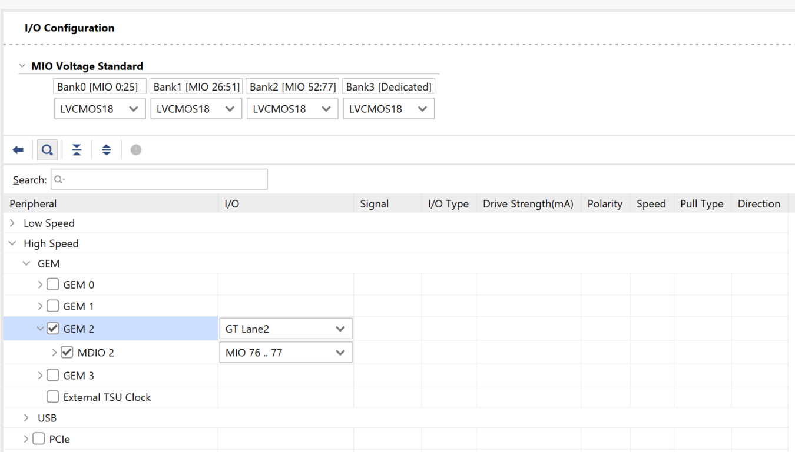

# 6 PS Gigabit Ethernet Module (GEM)

The Gigabit Ethernet Controller (GEM) in the Zynq UltraScale+ Processing System supports 10/100/1000 Mbit/s Ethernet communication and is fully compliant with IEEE 802.3-2008. The PS includes four independent GEM instances, each configurable to operate in various modes, including RGMII via MIO, GMII via EMIO, and SGMII through the PS-GTR transceivers. GEM supports full-duplex at 1 Gbit/s and both half-duplex and full-duplex at 10/100 Mbit/s. It features a built-in DMA controller with AXI Interface for efficient data handling, and includes an MDIO interface for PHY management.



In Enclustra modules, the RGMII mode is typically used, with the PHY connected to the MIO pins. However, in some modules, the PHY is connected to the PL pins. In these cases, the GEM is configured to use EMIO, enabling the Ethernet interface to be routed through the PL.

## 6.1 GMII (Gigabit Media Independent Interface)

GMII is a standard interface used to connect the Gigabit Ethernet MAC Layer to the PHY. It supports data rates up to 1 Gbit/s and includes separate transmit and receive clocks, data buses, and control signals. GMII uses 8-bit data paths for both transmit and receive operations, resulting in a total of 24 signals (including data, control, and clocks).

GMII signals can be routed via EMIO to the PL, allowing for flexible connectivity to external PHY through custom logic or converters.

  

Since the PHY used on Enclustra modules does not support the GMII interface, a GMII-to-RGMII converter is implemented on the PL side. This converter bridges the interface between the PS GEM's GMII signals and the external PHY's RGMII interface. The converter is included as part of the provided reference designs. For more details on its implementation and usage, please refer to [Chapter 5](./Chapter-5-GMII_to_RGMII.md).


## 6.2 RGMII (Reduced Gigabit Media Independent Interface)

RGMII is a widely used interface standard that connects the Gigabit Ethernet MAC to the PHY, similar to GMII but with a reduced pin count. Unlike GMII, RGMII uses a 4-bit data bus for both transmit and receive paths and employs double data rate signaling. This allows it to maintain 1 Gbit/s throughput while reducing the total number of required signals.

When the PS GEM Controller is configured to use MIO pins, the interface operates in RGMII mode. In this case, the RGMII signals are directly connected from PS MIO pins to the external PHY on the Enclustra modules, eliminating the need for a GMII-to-RGMII converter in the PL. 


  

For detailed information on RGMII timing, please refer to [Chapter 2](./Chapter-2-RGMII_timing_constraints.md), which covers the signal alignment, skew requirements, and delay configuration of the PHY.

## 6.3 SGMII (Serial Gigabit Media Independent Interface)

SGMII is a high-speed serial interface standard used to connect the Ethernet MAC and PHY over a single differential pair in each direction transmit and receive. Unlike GMII or RGMII, which use parallel data buses, SGMII transmits data serially at 1.25 Gbit/s using 8b/10b encoding, maintaining compatibility with standard Gigabit Ethernet speeds.

When the PS GEM is configured in SGMII mode, it requires a high-speed serial interface to communicate with an external SGMII PHY. In this configuration, the PS GTR is utilized to transmit and receive the serial differential signals. The PS GTR handles the physical layer signaling required for the SGMII protocol. The GEM I/O should be configured as GT Lane to route the SGMII signals through the interconnection matrix to the GTR transceiver.





  

Enclustra modules are usually designed to support RGMII mode, connecting the PS GEM interface directly to the external PHY through MIO pins. However, an SGMII connection can be implemented on the PL side using AMD’s AXI Ethernet Subsystem IP, which includes native support for SGMII mode. This allows high-speed serial Ethernet connectivity through PL when required by the design.

For detailed information on the implementation and configuration of SGMII using AXI Ethernet Subsystem, please refer to [Chapter 3](./Chapter-3-1G_PL_SFP.md).

## 6.4 Device Tree

The device tree is automatically generated by the PetaLinux tool based on the GEM configuration defined in the hardware design. The relevant .dtsi files include the device tree nodes for each configured GEM instance. 

The file `<project-dir>/components/plnx_workspace/device-tree/device-tree/zynqmp.dtsi` includes device tree nodes for all GEM controllers, even if some of them are not activated in the hardware project. This is part of the default PetaLinux behavior, where all potential GEM instances are described in the device tree.

```dts
gem0: ethernet@ff0b0000 {
    compatible = "cdns,zynqmp-gem", "cdns,gem";
    status = "disabled";
    interrupt-parent = <&gic>;
    interrupts = <0 57 4>, <0 57 4>;
    reg = <0x0 0xff0b0000 0x0 0x1000>;
    clock-names = "pclk", "hclk", "tx_clk", "rx_clk", "tsu_clk";
    #address-cells = <1>;
    #size-cells = <0>;
    #stream-id-cells = <1>;
    iommus = <&smmu 0x874>;
    power-domains = <&zynqmp_firmware PD_ETH_0>;
    resets = <&zynqmp_reset ZYNQMP_RESET_GEM0>;
};

gem1: ethernet@ff0c0000 {
    compatible = "cdns,zynqmp-gem", "cdns,gem";
    status = "disabled";
    interrupt-parent = <&gic>;
    interrupts = <0 59 4>, <0 59 4>;
    reg = <0x0 0xff0c0000 0x0 0x1000>;
    clock-names = "pclk", "hclk", "tx_clk", "rx_clk", "tsu_clk";
    #address-cells = <1>;
    #size-cells = <0>;
    #stream-id-cells = <1>;
    iommus = <&smmu 0x875>;
    power-domains = <&zynqmp_firmware PD_ETH_1>;
    resets = <&zynqmp_reset ZYNQMP_RESET_GEM1>;
};

gem2: ethernet@ff0d0000 {
    compatible = "cdns,zynqmp-gem", "cdns,gem";
    status = "disabled";
    interrupt-parent = <&gic>;
    interrupts = <0 61 4>, <0 61 4>;
    reg = <0x0 0xff0d0000 0x0 0x1000>;
    clock-names = "pclk", "hclk", "tx_clk", "rx_clk", "tsu_clk";
    #address-cells = <1>;
    #size-cells = <0>;
    #stream-id-cells = <1>;
    iommus = <&smmu 0x876>;
    power-domains = <&zynqmp_firmware PD_ETH_2>;
    resets = <&zynqmp_reset ZYNQMP_RESET_GEM2>;
};

gem3: ethernet@ff0e0000 {
    compatible = "cdns,zynqmp-gem", "cdns,gem";
    status = "disabled";
    interrupt-parent = <&gic>;
    interrupts = <0 63 4>, <0 63 4>;
    reg = <0x0 0xff0e0000 0x0 0x1000>;
    clock-names = "pclk", "hclk", "tx_clk", "rx_clk", "tsu_clk";
    #address-cells = <1>;
    #size-cells = <0>;
    #stream-id-cells = <1>;
    iommus = <&smmu 0x877>;
    power-domains = <&zynqmp_firmware PD_ETH_3>;
    resets = <&zynqmp_reset ZYNQMP_RESET_GEM3>;
};
```

While the `zynqmp.dtsi` file provides the base hardware definitions for the Zynq UltraScale+ platform, the `pwc.dtsi` file dynamically defines and configures device tree nodes based on the actual hardware setup. If a GEM controller is enabled in the Vivado hardware project, it will be reflected in the device tree by enabling the corresponding GEM node.

Additionally, the PHY mode is automatically set according to the configuration of the GEM controller. For example, the following device tree nodes indicate that GEM1 is configured in GMII mode and GEM3 is configured in RGMII mode, reflecting the settings from the Vivado design.

`<project-dir>/components/plnx_workspace/device-tree/device-tree/pwc.dtsi`

```dts
&gem1 {
	phy-mode = "gmii";
	status = "okay";
	xlnx,ptp-enet-clock = <0x0>;
};
&gem3 {
	phy-mode = "rgmii-id";
	status = "okay";
	xlnx,ptp-enet-clock = <0x0>;
} 
```
